## 1. Permbledhje

Ky kerkim trajton ndertimin e nje sistemi per menaxhimin remote te stacioneve te karikimit per makinat elektrike. Per te provuar komunikimin eshte ndertuar nje proof of concept me NestJS, React dhe nje simulator OCPP. Backend-i pranon lidhje WebSocket, perpunon nje subset te OCPP 1.6-J, dergon komanda start/stop dhe ekspozon statuset dhe leximet e metrit per aplikacionin.

Rezultati kryesor eshte nje ndarje midis kerkeses se perdoruesit, komandes OCPP dhe ngjarjes qe raporton karikuesi. Pranimi i nje komande nuk provon qe makina ka filluar ose perfunduar karikimin. Kjo gjendje duhet ndjekur nga mesazhet e karikuesit dhe nga seanca e ruajtur ne backend.

Implementimi aktual mban te dhenat vetem ne memorie. Ai demonstron rrjedhen e komunikimit, por nuk ka ende autentikim, autorizim mbi seancat, persistence ose koordinim midis disa instancave. Keto kufizime, bashke me bug-et konkrete, analizohen ne seksionet ne vazhdim.

Shenim mbi strukturen: seksionet nga Proposed Architecture deri te Security trajtojne nje arkitekture fillestare per nje sistem qe synon perdorim real, bashke me kufizimet dhe pyetjet qe kerkojne studim te metejshem. Proof of Concept dhe seksionet pas tij dokumentojne implementimin prove, evidencen dhe kufizimet e tij. Screenshot-et jane nga fazat e zhvillimit dhe nuk vertetojne automatikisht sjelljen e versionit aktual.

## 2. Konstatimi i Problemit dhe Kuadri

### 2.1 Problemi

Objektivi i ketij kerkimi eshte te investigoj arkitekturen dhe teknologjite te nevojshme per krijimin e nje sistemi te afte per te menaxhuar ne menyre remote stacionet e karikimit per makinat elektrike.

Perdorimi paresore i konsideruar eshte nje perdorues i cili lidh makinen e tij elektrike ne nje stacion karikimi dhe fillon ose terminon karikimin e makines se tij nepermjete nje aplikacioni.

Per kete arsye sistemit i nevojitet komunikim midis dy domaineve te ndryshme: Nje aplikacion per perdoruesin dhe nje infrastrukture fizike per karikimin e makinave elektrike.

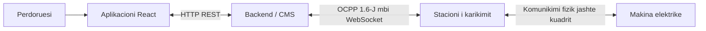

####  2.1.1 Objektivat

Kerkimi do te vendosi:

- Se si stacionet e karikimit per makinat elektrike komunikojne me sistemet qendrore (CMS).
- Cili protokoll komunikimi duhet perdorur.
- Si te performohen veprimet 'remote'.
- Si duhet te prezantohen statuset dhe seancat e karikimit.
- Si duhet te komunikoj backend-i me stacionet e karikimit dhe aplikacionin e perdoruesit.
- Si duhet shkallezuar arkitektura per te akomoduar me shume stacione karikimi ose me shume perdorues.
- Si te adresohen shqetesimet mbi besueshmerine dhe sigurine e sistemit.

#### 2.1.2 Kuadri

Ne kuader te kerkimit:

- OCPP communication
- Charger connection management
- Charger status
- Remote start
- Remote stop
- Charging sessions
- Meter readings
- Backend architecture
- Client/backend interaction
- Persistence
- Security considerations
- Scaling considerations

Jashte kuadrit te kerkimit:

- Payment processing
- Billing
- Physical charger installation
- Vehicle-side communication protocols
- Production deployment

## 3. Kerkesat

### 3.1 Kerkesat Funksionale

| ID    | Kerkesa                                                                                                        |
| ----- | -------------------------------------------------------------------------------------------------------------- |
| KF-01 | Sistemi duhet te pranoj stacione karikimi te lidhura.                                                          |
| KF-02 | Sistemi duhet te mbaj mend/ruaj statusin aktual te cdo konektori ne nje stacion karikimi.                      |
| KF-03 | Perdoruesi duhet te kete mundesin te kerkoj ne menyre remote fillimin e nje seance karikimi per makinen e tij. |
| KF-04 | Perdoruesi duhet te kete mundesin te kerkoj ne menyre remote mbylljen e nje seance karikimi per makinen e tij. |
| KF-05 | Sistemi duhet te pranoj informacion mbi seancen e karikimit nga stacioni i karikimit.                          |
| KF-06 | Sistemi duhet te pranoj lexime te metrit te karikimit gjate seances se karikimit.                              |
| KF-07 | Aplikacioni duhet te shfaq statusin aktual te karikuesit/secionit te karikimit.                                |

### 3.2 Kerkesat Jo-funksionale

| Kategoria                  | Kerkesa                                                                                           |
| -------------------------- | ------------------------------------------------------------------------------------------------- |
| Siguria (Security)         | Komunikimi midis karikuesit dhe perdoruesit duhet te jene te authentikuara dhe enkriptuara.       |
| Besueshmeria (Reliability) | Nderprerjet e karikuesit dhe timeout-te te komandave duhet te menaxhohen ne menyre te sigurte.    |
| Shkallezimi (Scalability)  | Arkitektura duhet te suportoje ne menyre te njehkohsishme lidhjen e disa stacioneve te karikimit. |
| Vazhdimesi (Persistence)   | Seancat e karikimit duhet t'ju mbijetojne restarteve te backend-it.                               |
| Observimi (Observability)  | Evente ose komanda te rendesishme duhet te logohen.                                               |

## 4. Kerkim mbi OCPP

### 4.1 Cfare eshte OCPP?

OCPP (Open Charge Point Protocol) eshte nje standart komunikimi i cili lejon stacionet e karikimit te makinave elektrike te komunikojne me software menaxhimi qendrore (CMS), pavaresisht se kush i ka krijuar.

### 4.2 Justifikimi i ekzistences

Para krijimit te nje protokollit standart, cdo prodhues i stacioneve te karikimit per makinat elektrike krijonte versionin e tij te nje protokolli komunikimi. Keshtu, cdo stacion karikimi mund te komunikonte vetem me backend-in e tij personal. Kjo metod krijon disa probleme:

- Operatoret ishin te lidhur me ekosistemin e vetem nje prodhuesi, si ne aspektin e hardware, si edhe ne software.
- Te operoje nje rrjete komunikimi midis disa stacioneve karikimi te llojeve te ndryshme ishte praktikisht e pamundur.
- Cdo modeli karikimi kerkonte zhvillimin e nje protokolli personal, qe rriste kostot.
- Ne keto sisteme te mbyllura zhvillimi ishte teper i avashte, dhe si rrjedhoje zhvillimi i industrise ishte gjithashtu i avashte.

### 4.3 Versionet e OCPP

Versionet kryesore te ofruara aktualisht nga Open Charge Alliance jane OCPP 1.6, OCPP 2.0.1 dhe OCPP 2.1. Ekzistojne edhe versione me te vjetra. OCPP 1.6 mbetet gjeresisht i perdorur; OCPP 2.0.1 zgjeron menaxhimin e pajisjeve, sigurine dhe trajtimin e tranzaksioneve. OCPP 2.1 eshte publikuar ne 2025 dhe shton, midis te tjerash, funksionalitete per karikim bidireksional. OCPP 1.6 dhe 2.0.1 nuk jane kompatibel ne protokoll. [Burimi: Open Charge Alliance](https://openchargealliance.org/protocols/open-charge-point-protocol/).

Ne projektin shembull eshte perdorur OCPP 1.6-J me JSON. Kjo zgjedhje pershtatet me simulatorin dhe me kerkesat e remote start/stop. OCPP 1.6 ka edhe variant SOAP, por backend-i i ketij projekti implementon vetem komunikimin JSON mbi WebSocket.

Zgjedhja ne production duhet te varet nga pajisjet konkrete, kerkesat funksionale dhe profili i sigurise. Mbeshtejtja e Plug & Charge lidhet edhe me komunikimin e makines me karikuesin dhe me menaxhimin e certifikatave; nuk arrihet vetem duke ndryshuar nje string versioni ne backend.

#### 4.3.1 Komunikimi

OCPP -> WebSocket -> TCP/IP
OCPP operon ne baze te nje arkitekture klient-server ku stacioni i karikimit sillet si klienti, ndersa CMS sillet si serveri. Komunikimi midis tyre funksionon nepermjete nje lidhjeje te vazhdueshme me WebSocket, duke lejuar keshtu dergim te mesazheve ne te dyja drejtimet.
Stacioni i karikimit e nis perpjekjen per te hapur nje lidhje websocket me CMS-in, i cili me pas duhet ta pranoj.

##### 4.3.1.1 URL i lidhjes

Per te nisur nje lidhje websocket, stacioni i karikimit i duhet nje URL ku te lidhet. Kjo URL permban 'identitetin' e atij stacioni karikues per t'i treguar CMS-it se me cilin stacion po krijon lidhje. Per kete arsye cdo stacion karikimi ka URL-in e tij specifik, identifikues.

CMS-i duhet te ofroje te pakten nje *OCPP endpoint URL*, prej te ciles stacioni i karikimit te derivoj URL-n e saj te lidhjes.

Per te derivuar URL-n e saj, stacioni i karikimit modifikon URL e ofruar nga CMS duke i shtuar fillimisht nje '/' dhe me pas nje *string* qe e identifikon ate.
Pershembull, per nje stacion karikimi me identitet 'SK001', i cili po perpiqet me nje CMS me URL: 'ws://cms.shembull.com/ocpp', URL-i i lidhjes do te ishte i tille:
'ws://cms.shembull.com/ocpp/SK001'

Versioni ekzakte i OCPP ne perdorim duhet specifikuar ne nje header 'Sec-Websocket-Protocol'

##### 4.3.1.2 Pergjigja e Serverit

Pas marrjes se kerkeses CMS-i negocion lidhjen dhe versionin. Ne arkitekturen e synuar identiteti duhet kontrolluar kundrejt regjistrit te karikuesve dhe kredencialeve te tyre, perpara se pajisja te lejohet te komunikoje.

Ne kodin aktual kontrollohet vetem qe segmenti i fundit i URL-se te mos jete bosh. Cdo identitet i ri regjistrohet ne memorie. Pra `/ocpp/CP_001` identifikon pajisjen qe pretendon klienti, por nuk provon qe klienti eshte vertet ajo pajisje.

`handleProtocols` zgjedh `ocpp1.6`, por kthimi `false` ne biblioteken `ws` vetem heq header-in e subprotocol-it nga pergjigjja. Nuk duhet trajtuar si kontroll i plote autentikimi ose si garanci qe serveri mbyll vete cdo lidhje pa protokoll te vlefshem. [Dokumentacioni i ws](https://github.com/websockets/ws/blob/master/doc/ws.md).

#### 4.3.2 Mesazhet OCPP

##### 4.3.2.1 Llojet e mesazheve

OCPP perdor nje protokoll personal mbi Websocket ne menyre qe te identifikoj se cilat mesazhe jane 'requests' dhe cilat 'responses'. Per kete arsye, mesazhet e derguara jane tre llojesh:

| Lloji i mesazhit | Numri | Drejtimi |
| --- | --- | --- |
| CALL | 2 | CP → CMS ose CMS → CP |
| CALLRESULT | 3 | Ne drejtimin e kundert te CALL perkates |
| CALLERROR | 4 | Ne drejtimin e kundert te CALL perkates |

Stacioni mbetet klienti WebSocket, por te dyja palet mund te dergojne CALL. Pershembull, `BootNotification` niset nga karikuesi, ndersa `RemoteStartTransaction` nga CMS-i. ID-ja lidh kerkesen me pergjigjen. Ne kete projekt numrat e panjohur te mesazheve nuk perpunohen.

##### 4.3.2.2 ID e Mesazhit

ID-ja e Mesazhit sherben per te identifikuar nje kerkese. Kjo ID duhet te jete ndryshe per cdo mesazh CALL qe nje stacioni dergon ne po te njejtin lidhje WebSocket. ID-ja e nje pergjigjeje CALLRESULT ose CALLERROR duhet te jete e **njejte** me kerkesen CALL per te cilen po pergjigjet.

##### 4.3.2.3 Formati i mesazhit

###### Call

Nje mesazh *CALL* perfshin 4 (kater) elemente:

```
[<MessageTypeId>, "<UniqueId>", "<Action>", {<Payload>}]
```

Ku:

| Fusha    | Kuptimi                                                                           |
| -------- | --------------------------------------------------------------------------------- |
| UniqueId | Identifikuese unik i cili do te perdoret per te perputhur kerkesen me pergjigjen. |
| Action   | Emri i procedures (string)                                                        |
| Payload  | Nje JSON i cili permban argumented e nevojshme per proceduren 'Action'            |
Pershembulll, nje kerkes *BootNotification* do te dukej keshtu:

```
[
2,
"123456",
"BootNotification",
	{
		"chargePointVendor":"VendorX", "chargePointModel":"SingleSocketCharger"
	}
]
```

###### CallResult

Nese kerkesa *CALL* procesohet me sukses, pergjigjia do te jete nje *CALLRESULT*, i cili duket i tille:

```
[<MessageTypeId>, "<UniqueId>", {<Payload>}]
```

Ku:

| Fusha    | Kuptimi                                                                     |
| -------- | --------------------------------------------------------------------------- |
| UniqueId | Duhet te i njejti ID qe eshte ne kerkesen CALL.                             |
| Payload  | Nje objekt JSON qe permban rezultatet e ekzekutimit te procedures 'Action'. |
Pershembull, nje pergjigje *BootNotification* do te dukej e tille:

```
[
3,
"123456",
{
"status":"Accepted", "currentTime":"2013-02-01T20:53:32.486Z", "interval":300
}
]
```

###### CallError

CALLERROR raporton nje gabim ne perpunimin e nje CALL, pershembull nje action te pambeshtetur ose nje payload te pavlefshem. Refuzimi normal i nje komande mund te jete nje CALLRESULT me `status: "Rejected"`. Keto dy raste duhen dalluar nga humbja e lidhjes ose timeout-i lokal, ku mund te mos vije fare nje pergjigje.

```text
[4, "<UniqueId>", "<errorCode>", "<errorDescription>", {<errorDetails>}]
```

Shembull ilustrues per nje action qe backend-i nuk e implementon:

```json
[4, "req-unknown-1", "NotImplemented", "Action not supported", {}]
```

Backend-i aktual trajton CALLERROR per komandat qe ka derguar vete. Mungon ende gjenerimi sistematik i CALLERROR per CALL-et hyrese te pambeshtetura ose me payload te pavlefshem.

#### 4.3.3 Komanda OCPP me interes

Ne projektin prove eshte implementuar nje subset i komandave OCPP:

| Komanda                | Drejtimi       | Qellimi                                                  |
| ---------------------- | -------------- | -------------------------------------------------------- |
| BootNotification       | Karikues → CMS | Regjistron nje stacion karikimi                          |
| Heartbeat              | Karikues → CMS | Sinjalizon qe stacioni i karikimit eshte ende funksional |
| StatusNotification     | Karikues → CMS | Raporton gjendjen/statusin e stacionit te karikimit      |
| RemoteStartTransaction | CMS → Karikues | Kerkon fillesen e karikimit 'remote'                     |
| StartTransaction       | Karikues → CMS | Raporton fillesen aktuale te tranzaksionit               |
| MeterValues            | Karikues → CMS | Raporton matje                                           |
| RemoteStopTransaction  | CMS → Karikues | Kerkon mbylljen e karikimit 'remote'                     |
| StopTransaction        | Karikues → CMS | Raporton perfundimin e tranzaksionit                     |
| Authorize | Karikues → CMS | Kerkon autorizimin e nje idTag |

## 5. Proposed Architecture

Per kete sistem do te nisja me nje arkitekture te thjeshte: nje aplikacion klient, nje backend NestJS dhe nje databaze PostgreSQL. Backend-i do te komunikoje me aplikacionin permes HTTP dhe me stacionet e karikimit permes OCPP mbi WebSocket.

Kjo ndarje me duket e mjaftueshme per te kuptuar dhe implementuar rrjedhen kryesore: perdoruesi kerkon karikimin, backend-i kontrollon kerkesen dhe ia dergon karikuesit, pastaj ruan dhe shfaq pergjigjet e tij. Fillimisht do te perdorja nje instance backend-i. Ndarja ne disa servera do te kerkoje studim te metejshem.

Propozimi eshte nje pike fillestare per nje aplikacion qe synon perdorim real. Ai perfshin nevojat baze, por nuk zgjidh ende te gjitha rastet e deshtimit ose te ngarkeses se larte. Ne seksionet me poshte kam lene edhe pyetje qe do te diskutoja perpara nje implementimi production.

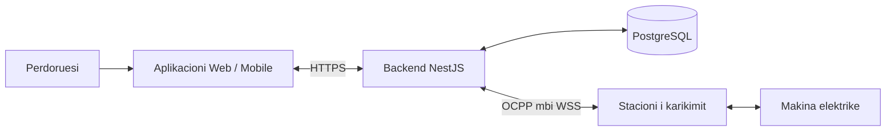

### 5.1 Aplikacioni Klient

Aplikacioni duhet t'i lejoje perdoruesit te beje login, te shohe stacionet e disponueshme dhe te zgjedhe nje konektor. Pas lidhjes se makines, perdoruesi mund te kerkoje fillimin ose ndalimin e karikimit.

Ne UI do te shfaqja statusin e konektorit, seancen aktive dhe matjet e fundit qe ka raportuar karikuesi. Do te shfaqja gjithashtu kohen e perditesimit, sepse nje matje e vjeter nuk duhet te duket sikur eshte marre tani.

Per perditesimin e gjendjes do te nisja me polling, pershembull nje kerkese cdo 2 sekonda kur perdoruesi ka hapur seancen. Kjo eshte e thjeshte per t'u implementuar. Nese numri i perdoruesve rritet, do te shqyrtoja nese backend-i duhet t'i dergoje vete perditesimet, ne vend qe klienti te pyese vazhdimisht.

Nje gje qe duhet te dallohet ne UI eshte “kerkesa u pranua” nga “karikimi filloi”. Per kete arsye, pas shtypjes se Start do te shfaqja nje gjendje pritjeje derisa te vije informacion nga karikuesi.

**Pyetje per diskutim:** A duhet perdoruesi ta zgjedhe karikuesin nga nje liste apo te skanoje nje QR? Sa shpesh ka kuptim te perditesohen matjet ne ekran?

### 5.2 NestJS Backend

Do ta organizoja backend-in ne module dhe service brenda te njejtit aplikacion. Controller-at do te pranonin kerkesat HTTP, ndersa service-t do te mbanin logjiken kryesore.

| Pjesa | Pergjegjesia |
| --- | --- |
| Auth | Login dhe identifikimi i perdoruesit |
| Chargers | Lista e karikuesve dhe gjendja e konektoreve |
| Charging Sessions | Fillimi, ndalimi dhe ruajtja e seancave |
| OCPP | Lidhjet WebSocket dhe komunikimi me pajisjet |

Kur vjen nje kerkese start, backend-i duhet te kontrolloje perdoruesin, karikuesin dhe konektorin. Kur vjen nje kerkese stop, duhet te kontrolloje edhe qe seanca i perket atij perdoruesi. Keto kontrolle duhet te kryhen ne backend, edhe nese UI-ja i fsheh butonat per veprime qe nuk lejohen.

Per API-ne do te propozoja keto veprime:

| Endpoint i propozuar | Qellimi |
| --- | --- |
| `GET /chargers` | Liston karikuesit ku perdoruesi ka akses |
| `GET /chargers/:id` | Shfaq gjendjen e nje karikuesi |
| `POST /chargers/:id/start` | Kerkon fillimin ne nje konektor |
| `GET /sessions/:id` | Shfaq seancen dhe matjet e saj |
| `POST /sessions/:id/stop` | Kerkon ndalimin e nje seance te caktuar |

Per stop do te preferoja ID-ne e seances ne API. Keshtu behet me e qarte cili karikim po ndalohet. Backend-i e perkthen kete ID ne transactionId qe pret karikuesi.

**Pyetje per diskutim:** A duhet kerkesa HTTP te prese pergjigjen e karikuesit, apo te kthehet menjehere dhe rezultati te lexohet me vone? Pritja eshte me e thjeshte, por nje karikues i ngadalte e mban kerkesen hapur.

### 5.3 Shtresa OCPP

Shtresa OCPP do te kujdeset per lidhjen me karikuesit. Per nje instance backend-i, nje `Map<string, WebSocket>` mund te lidhe ID-ne e karikuesit me socket-in e tij. Kjo e lejon backend-in te gjeje lidhjen ku duhet te dergoje nje komande.

Do t'i mbaja te ndara pergjegjesite kryesore:

- Menaxhimi i lidhjeve dhe shkeputjeve.
- Leximi dhe kontrolli i mesazheve OCPP.
- Dergimi i komandave dhe perputhja e pergjigjeve me messageId.
- Kalimi i statusit, seancave dhe matjeve te service-t perkatese.

Per komandat remote duhet pritur CALLRESULT ose CALLERROR. Nje Promise mund te perdoret per kete pritje, me nje timeout qe te mos mbetet e hapur pafund. Timeout-i tregon qe nuk u mor pergjigje ne kohe; nuk provon qe komanda nuk u ekzekutua.

Tipet TypeScript e bejne kodin me te qarte, por te dhenat qe vijne nga pajisja duhet te kontrollohen edhe ne runtime. Pershembull, nje MeterValues pa `meterValue` te vlefshem nuk duhet te perpunohen sikur payload-i te ishte i sakte.

**Pyetje per diskutim:** Cfare duhet bere nese dy lidhje perdorin te njejtin ID karikuesi? Po nese nje pergjigje vjen pasi ka mbaruar timeout-i?

### 5.4 Databaze PostgreSQL

Do te perdorja PostgreSQL per te ruajtur perdoruesit, karikuesit dhe seancat. Arsyeja kryesore eshte qe keto te dhena nuk duhet te humbasin kur backend-i riniset.

Ne memorie do te mbaheshin lidhjet WebSocket dhe kerkesat qe presin pergjigje. Ne databaze do te ruheshin seancat, pronari i tyre, koha e fillimit dhe mbarimit, si dhe matjet qe duhen per historine.

Databaza nuk e zgjidh vete komunikimin me pajisjen. Nese backend-i riniset gjate nje karikimi, seanca mund te jete e ruajtur por lidhja WebSocket humbet. Duhet te percaktohet si do te lidhet informacioni i ri i karikuesit me seancen ekzistuese.

**Pyetje per diskutim:** A duhet te ruajme cdo matje te marre, apo vetem disa prej tyre? Cfare informacioni duhet te kemi per te rikuperuar nje seance pas restart-it?

## Core System Flows

### Lidhja e karikuesit

Karikuesi hap lidhjen me backend-in. Backend-i duhet te verifikoje identitetin e tij dhe versionin e protokollit, pastaj te perpunojë BootNotification. Me StatusNotification merret gjendja e konektorit, ndersa Heartbeat ndihmon per te ndjekur komunikimin periodik.

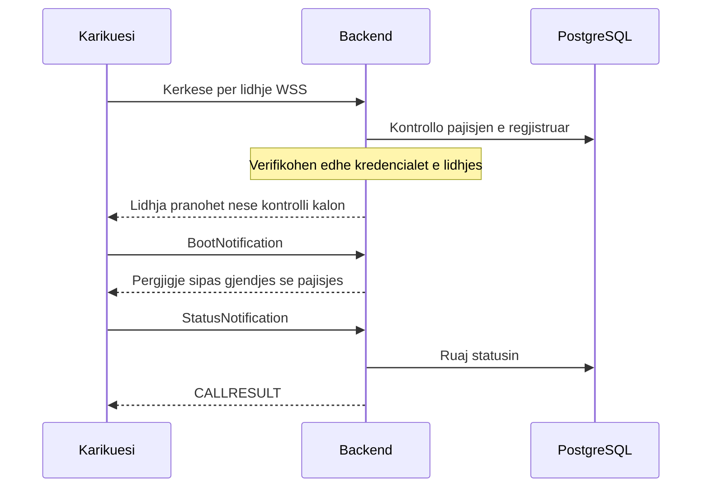

Ky eshte nje diagram i thjeshtuar. Vetem ekzistenca e ID-se ne databaze nuk mjafton per te besuar pajisjen; nevojitet edhe autentikimi i lidhjes.

### Fillimi i karikimit

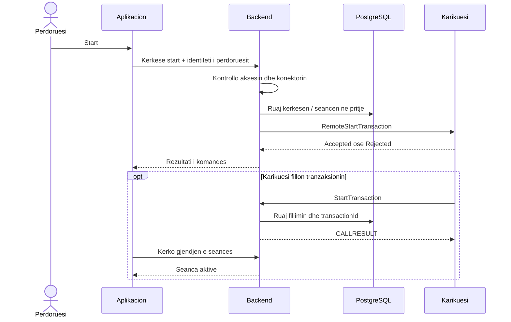

Diagrami perdor komandat OCPP 1.6-J. Sipas konfigurimit, karikuesi mund te dergoje edhe Authorize. Backend-i duhet te kontrolloje identifikuesin e karikimit perpara pranimit.

Nje pike qe duhet studiuar me tej eshte si lidhet StartTransaction me kerkesen e duhur te perdoruesit. Duhet te merren parasysh karikuesi, konektori dhe identifikuesi i autorizuar, sidomos kur disa perdorues po perdorin sistemin njekohesisht.

### Matjet dhe shfaqja ne aplikacion

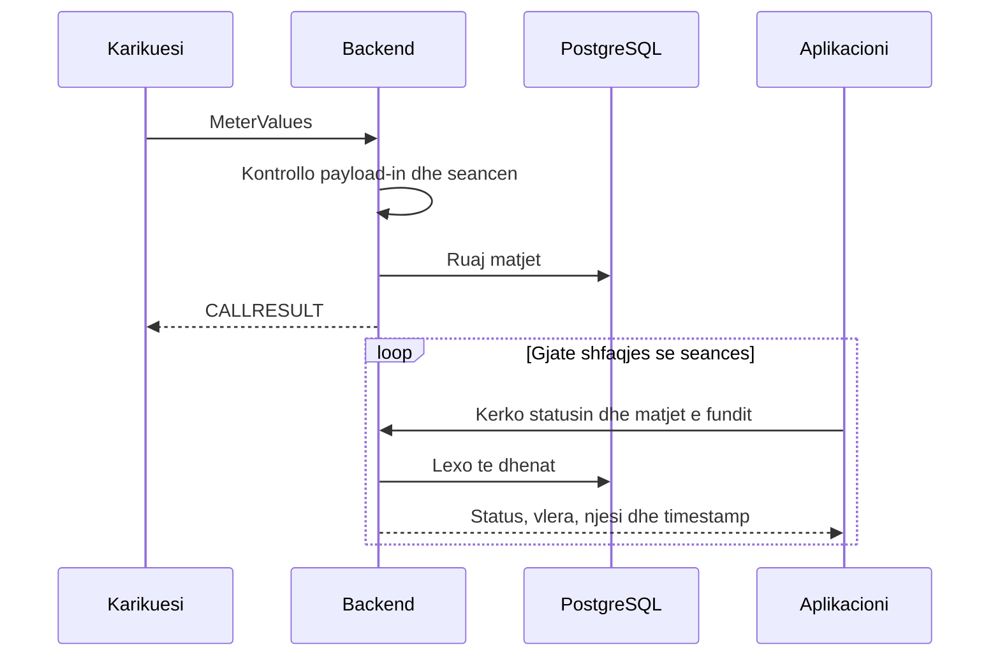

Koha kur UI-ja ben polling dhe koha kur karikuesi dergon matje nuk jane te njejta. Aplikacioni mund te marre te njejten matje ne disa kerkesa radhazi. Per kete arsye timestamp-i duhet te jete pjese e pergjigjes.

### Ndalimi i karikimit

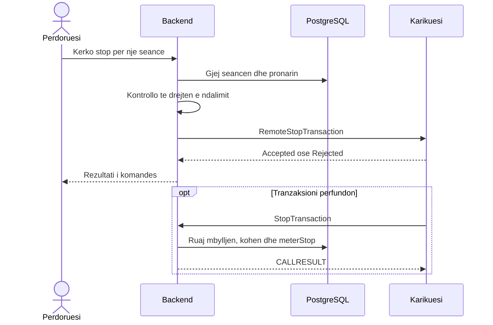

Seanca duhet te shenohet e perfunduar nga informacioni i karikuesit, jo vetem nga shtypja e butonit Stop. Ajo mund te perfundoje edhe nga nje veprim lokal, pa nje kerkese nga aplikacioni.

## Backend / OCPP Design

### Si do te organizohej komunikimi

Controller-i do te marre kerkesen e perdoruesit dhe do te therrase service-in e seancave. Ky service do te beje kontrollet dhe do t'i kerkoje shtreses OCPP dergimin e komandes. Kur vjen nje mesazh nga karikuesi, shtresa OCPP do ta kaloje informacionin te service-i perkates.

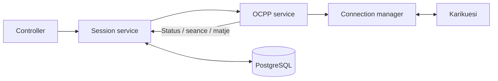

Kjo ndarje do te me ndihmonte te ndryshoja logjiken e seancave pa ndryshuar cdo here kodin e WebSocket-it. Fillimisht do te mbaja vetem versionin OCPP te nevojshem per pajisjet e zgjedhura.

### Identifikuesit dhe gjendja

| Identifikuesi | Per cfare perdoret |
| --- | --- |
| User ID | Kush po kerkon karikimin |
| Charger ID dhe connector ID | Ku do te kryhet karikimi |
| Session ID | Seanca qe sheh aplikacioni |
| OCPP transactionId | Tranzaksioni qe njeh karikuesi |
| messageId | Perputh nje CALL me pergjigjen e tij |

Gjithashtu do te ndaja gjendjen e lidhjes nga gjendja e konektorit dhe e seances. Nje karikues mund te humbase internetin, por makina te vazhdoje te karikohet. Nuk do ta shenoja automatikisht seancen te perfunduar vetem sepse socket-i u mbyll.

### Rastet qe kerkojne me shume kujdes

Nese perdoruesi shtyp Start dy here, backend-i duhet te kontrolloje nese ka tashme nje kerkese ose seance aktive. Vetem çaktivizimi i butonit ne frontend nuk mjafton. Nese dy kerkesa vijne pothuajse ne te njejten kohe, nje kontroll i thjeshte ne kod mund te mos jete i mjaftueshem; ketu do te kerkoja ndihme per menyren e sakte te kontrollit ne databaze.

Nese komanda nuk merr pergjigje, do t'i tregoja perdoruesit qe rezultati nuk u konfirmua. Nuk do te beja automatikisht retry te start-it, sepse pajisja mund ta kete marre komanden e pare.

**Pyetje te hapura:** Si dallojme nje kerkese te perseritur nga nje kerkese e re? Sa duhet te jete timeout-i? Si duhet te reagojme kur StartTransaction vjen me vone, pasi perdoruesit i eshte shfaqur nje gabim?

## Data & Persistence Design

### Modeli fillestar i te dhenave

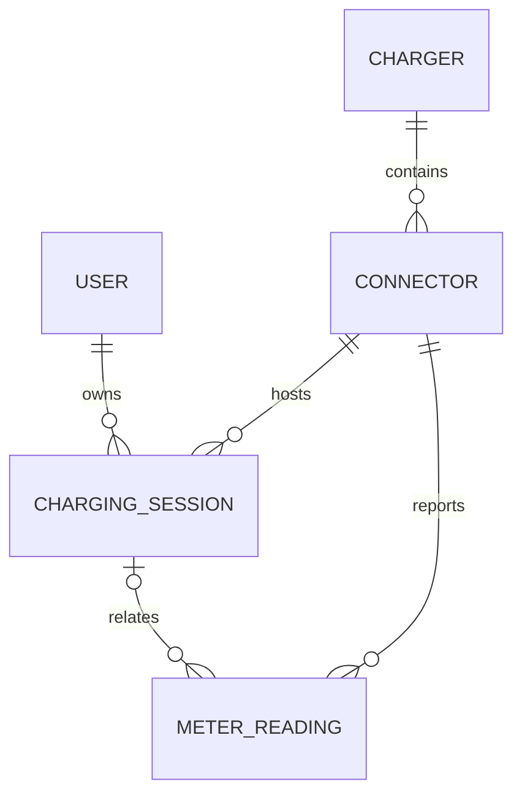

| Tabela | Fushat kryesore qe do te ruaja |
| --- | --- |
| Users | ID dhe te dhenat e nevojshme te llogarise |
| Chargers | ID, emri/vendndodhja dhe koha e fundit e komunikimit |
| Connectors | ID brenda karikuesit, chargerId dhe statusi |
| ChargingSessions | ID, userId, konektori, transactionId, statusi, fillimi, fundi, meterStart dhe meterStop |
| MeterReadings | Konektori, seanca nese njihet, timestamp-i, vlera, measurand dhe njesia/faza kur ka |

Nje seance e perfunduar nuk duhet te fshihet; ajo duhet te ruhet qe perdoruesi te shohe historine. Lidhja me perdoruesin duhet te jete ne databaze, ne menyre qe autorizimi i stop-it te mos varet nga informacioni qe dergon klienti.

Matjet nuk kane gjithmone transactionId. Per kete arsye, modeli lejon matje te lidhura me konektorin pa nje seance te caktuar. Detajet e ruajtjes se disa sampledValue brenda nje mesazhi do t'i saktesoja gjate projektimit te tabelave.

### Probleme te mundshme me ruajtjen

Nje seance perfshin disa ndryshime: krijimin e rekordit, lidhjen me konektorin dhe perditesimin e statusit. Keto duhet te mbeten te perputhshme. Do te perdorja transaksione database aty ku disa shkrime duhet te perfundojne se bashku, por nuk do te mbaja nje transaksion hapur gjate gjithe pritjes se pergjigjes nga karikuesi.

Mbetet nje rast i veshtire: backend-i mund ta ruaje kerkesen dhe te ndalet para dergimit, ose ta dergoje komanden dhe te ndalet para ruajtjes se rezultatit. Ruajtja ne database vetem nuk e zgjidh kete. Duhet percaktuar si zbulohen dhe kontrollohen kerkesat qe kane mbetur te paperfunduara.

Per matjet do te ruaja kohen e raportuar nga pajisja dhe kohen kur backend-i i mori. Kjo ndihmon kur matjet vijne me vonese. Nje lexim i vjeter mund te kete vlere per historine, por nuk duhet te zevendesoje matjen me te re ne UI.

**Pyetje per diskutim:** Sa histori duhet te ruhet? Si shmangen matjet ose seancat e dyfishuara? Cfare duhet te beje backend-i me seancat qe ne database jane aktive, por pajisja pas rilidhjes raporton nje gjendje tjeter?

## Scalability & Reliability

### Cfare ndodh kur rritet perdorimi?

Nje backend i vetem eshte me i thjeshte per t'u ndertuar dhe kuptuar, por ka kufij. Me shume karikues do te kete me shume lidhje WebSocket dhe mesazhe. Me shume perdorues do te kete me shume kerkesa HTTP. Databaza duhet te perballoje te dyja: ruajtjen e matjeve dhe leximet per aplikacionin.

Pershembull, 1,000 perdorues qe bejne polling cdo 2 sekonda krijojne rreth 500 kerkesa ne sekonde. Ky eshte vetem nje vleresim matematikor, jo nje prove qe sistemi mund ose nuk mund ta perballoje. Nese cdo kerkese kthen te gjithe karikuesit, ngarkesa rritet me tej.

Fillimisht do te kufizoja leximet te karikuesi ose seanca me interes dhe do te testoja sjelljen me disa kliente. Do te matja kohen e pergjigjes, perdorimin e memories dhe gabimet. Nuk mund te percaktoj nje kapacitet te sakte pa keto prova.

### Pse shtimi i nje backend-i tjeter nuk mjafton?

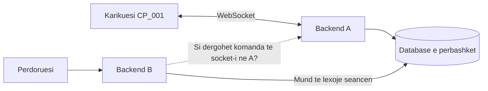

Nese pajisja eshte lidhur te A, backend-i B nuk e ka socket-in e saj. Nje database e perbashket ndihmon me te dhenat, por nuk e transferon lidhjen WebSocket. Sistemi duhet te dije cili backend e mban pajisjen dhe si t'ia kaloje atij komanden.

Kete pjese nuk do ta konsideroja ende te zgjidhur ne arkitekturen fillestare. Do te studioja komunikimin midis instancave dhe perdorimin e nje radhe mesazhesh, duke diskutuar me ekipin kur kjo kompleksitet behet e nevojshme.

### Probleme qe mund te hasen

| Problemi | Cfare mund te ndodhe | Hapi fillestar / pyetja |
| --- | --- | --- |
| Backend-i ndalet | Te gjitha lidhjet e atij procesi humbasin | Pajisjet duhet te rilidhen; si rikuperohen seancat? |
| Karikuesi humbet internetin | Gjendja ne aplikacion vjetrohet | Shfaq shkeputjen dhe kohen e fundit; mos perfundo seancen pa evidence |
| Komanda merr timeout | Nuk dihet nese u ekzekutua | Shfaq rezultat te pakonfirmuar dhe kontrollo ngjarjet pasuese |
| Dy Start per nje konektor | Mund te krijohen kerkesa konkurruese | Si behet kontrolli ne menyre te sigurt ne database? |
| Shume MeterValues | Rriten shkrimet dhe hapesira ne database | Mat volumin dhe vendos sa histori duhet ruajtur |
| Databaza nuk pergjigjet | Nuk ruhet ose lexohet seanca | Mos paraqit sukses pa ruajtje; si trajtohet nje stop urgjent? |
| Shume pajisje rilidhen njekohesisht | Backend-i mund te ngarkohet menjehere | Duhet testuar sjellja dhe intervali i tentativave te rilidhjes |
| Mesazh i perseritur | Mund te krijohen rekorde te dyfishta | Duhet nje menyre per te njohur ngjarjet e perpunuara |

Gjithashtu do te mbaja log-e qe tregojne karikuesin, messageId, action-in dhe rezultatin. Keshtu mund te ndiqet nje kerkese nga aplikacioni deri te pajisja. Monitorimi me i avancuar dhe testet me shume karikues do te ishin hapa te mevonshem.

**Pyetje per diskutim:** Cili do te jete kufiri i pare ne kete sistem: lidhjet, perpunimi i mesazheve apo databaza? Kur do te kishte kuptim shtimi i nje instance tjeter? Si do ta testonim kete perpara se te ndryshojme arkitekturen?

## Security

### Identiteti dhe te drejtat e perdoruesit

Perdoruesi duhet te beje login perpara se te kerkoje karikimin. Backend-i duhet te verifikoje identitetin ne cdo kerkese te mbrojtur. Por login nuk mjafton: duhet te kontrollohet edhe nese ai perdorues ka te drejte te veproje mbi seancen e kerkuar.

Shembulli me i rendesishem eshte stop. Nese perdoruesi A ndryshon ID-ne ne URL, ai nuk duhet te mund te ndaloje seancen e perdoruesit B. Backend-i duhet te lexoje pronarin e seances nga databaza dhe ta krahasoje me perdoruesin e autentikuar.

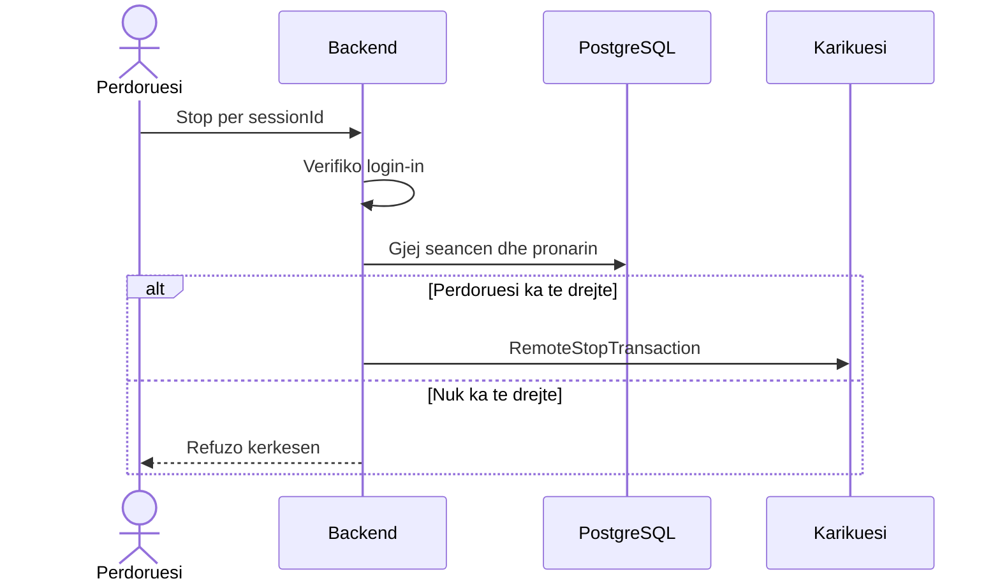

Nje operator mund te kete te drejta shtese, por duhet percaktuar qarte se cilat jane ato. Te njejtat kontrolle vlejne edhe per leximin e historise. OWASP rekomandon kontrollin e autorizimit ne cdo kerkese dhe refuzimin kur leja nuk eshte percaktuar. [OWASP — Authorization](https://cheatsheetseries.owasp.org/cheatsheets/Authorization_Cheat_Sheet.html).

### Identiteti i karikuesit

ID-ja ne URL e identifikon karikuesin qe klienti pretendon se eshte; nuk provon identitetin e tij. Per perdorim real duhet nje menyre autentikimi e suportuar nga pajisja, pershembull kredenciale individuale ose certifikate, dhe komunikim i enkriptuar me WSS/TLS.

Do ta zgjidhja menyren konkrete pasi te kontrolloja cfare suportojne karikuesit. OCPP 1.6 ka udhezime sigurie nga OCA qe duhen studiuar per kete pjese. [OCPP 1.6 Security Whitepaper](https://openchargealliance.org/ocpp-info-whitepapers/ocpp-1-6-security-whitepaper-4th-edition/).

`Authorize` dhe `idTag` ne OCPP jane pjese e autorizimit te karikimit. Nuk zevendesojne login-in e aplikacionit. Backend-i duhet te kontrolloje lidhjen midis perdoruesit, identifikuesit te karikimit dhe seances. Nuk duhet te pranoje automatikisht cdo idTag qe shkruan klienti.

### Kontrollet baze dhe pyetjet qe mbeten

| Kontrolli | Pse nevojitet |
| --- | --- |
| HTTPS dhe WSS | Per te mbrojtur komunikimin ne rrjet |
| Validimi i input-eve | Per te mos perpunuar payload-e te gabuara si te vlefshme |
| Kontrolli i pronarit te seances | Per te penguar veprimet mbi karikimin e dikujt tjeter |
| Kufizimi i kerkesave | Per te shmangur dergimin e pakufizuar te komandave |
| Log-e pa password ose token | Per te hetuar problemet pa ekspozuar kredencialet |

CORS nuk eshte mekanizem login-i ose autorizimi. Ai lidhet me sjelljen e browser-it dhe nuk pengon vetem ai nje klient tjeter te therrase API-ne.

**Pyetje per diskutim:** Si do t'i marrin karikuesit kredencialet e tyre? Cfare behet kur humbet nje password ose skadon nje certifikate? Kush duhet te mund ta ndaloje karikimin pervec pronarit? A duhet lejuar fillimi lokal kur pajisja nuk ka internet?

## 10. Proof of Concept dhe Evidenca

### 10.1 Cfare demonstron projekti

Proof of concept lidh simulatorin me backend-in dhe lejon aplikacionin te dergoje komanda. Funksionalitetet jane te pranishme ne kod, por mbulimi i rasteve negative eshte ende i kufizuar.

| Kerkesa | Gjendja ne implementim | Prova / kufizimi |
| --- | --- | --- |
| KF-01: Pranim lidhjesh | Implementuar | Figura 1; pa autentikim pajisjeje |
| KF-02: Status konektori | Implementuar ne memorie | StatusNotification → ChargeStateService |
| KF-03: Remote start | Implementuar | Controller → sendCall; mungon autorizimi real |
| KF-04: Remote stop | Implementuar me bug-e te hapura | Route stop ekziston; nevojitet prova e plote start-stop-start |
| KF-05: Informacion seance | Pjeserisht | Seance aktive ne Map; pa histori te qendrueshme |
| KF-06: Lexime metri | Implementuar per grupin me te fundit | Figura 4 dhe updateMeterValues; pa historik |
| KF-07: Shfaqje ne UI | Implementuar | Polling cdo 2 sekonda; screenshot-i i frontend-it duhet shtuar |

Per kerkesat jo-funksionale: lidhjet dhe logimi bazik ekzistojne, por persistence, kontrolli i aksesit, shkallezimi ne disa instanca dhe matjet e performances nuk jane realizuar ende.

### 10.2 Log-e qe mund te perdoren ne prezantim

Ky fragment eshte transkriptim i pjesshem i tekstit te dukshem ne screenshot-et ekzistuese:

```text
WebSocket connection received
URL: /ocpp/CP_001
Protocol: ocpp1.6
CP_001 Authorize: TEST
CP_001 connector 1: Preparing
```

Per te ndjekur nje rrjedhe te plote ne te ardhmen, log-et duhet te kene fusha te qendrueshme. Shembulli me poshte eshte **format i propozuar, jo log i prodhuar nga implementimi aktual**:

```json
{
  "event": "ocpp.command.result",
  "chargePointId": "CP_001",
  "connectorId": 1,
  "commandId": "command-demo-1",
  "messageId": "remote-start-1",
  "action": "RemoteStartTransaction",
  "result": "Accepted",
  "durationMs": 120
}
```

Duhet dalluar `messageId` i frame-it, `commandId` i kerkeses se aplikacionit dhe `transactionId` i seances OCPP. Ato nuk jane e njejta ID.

### 10.3 Screenshot-et qe mungojne

| Pamja qe duhet shtuar | Cfare duhet te jete e dukshme | Cfare provon |
| --- | --- | --- |
| Frontend + Network | Matjet dhe kerkesat periodike me timestamp | Backend → UI dhe polling |
| Rrjedha e plote stop | RemoteStopTransaction, StopTransaction, statusi final | Dallimin midis komandes dhe perfundimit |
| Gabimi i fshirjes se tranzaksionit | ID-ja e derguar, key i Map-it, rezultati i delete | Bug-un konkret te seances |
| Stop pa seance | HTTP status dhe body ne Network | Bug-un `return` kundrejt `throw` |
| Rilidhja | CP_001 shkëputet/rilidhet dhe gjendja ne UI | Menaxhimin e lidhjes |
| Restart gjate seances | Para/pas restart-it, seanca ne simulator dhe lista nga API | Humbjen e gjendjes ne memorie |

Nuk ka screenshot-e qe provojnë database, siguri ose load balancing, sepse keto pjese nuk jane implementuar. Per to duhen perdorur diagramet e propozuara. Per screenshot-et e reja duhen hequr kredencialet ose te dhenat personale, nese shfaqen.

### 10.4 Arkitektura dhe kontrata e implementimit prove

Pjesa e mesiperme pershkruan arkitekturen fillestare te propozuar dhe pyetjet e saj te hapura. Ne proof of concept eshte realizuar nje pjese me e vogel e kesaj arkitekture, me nje proces dhe gjendje ne memorie.

Backend-i ka dy pika hyrjeje: HTTP per aplikacionin dhe WebSocket per karikuesit. Te dyja ekzekutohen ne te njejtin proces NestJS dhe ndajne te njejtat service dhe Map-e ne memorie.

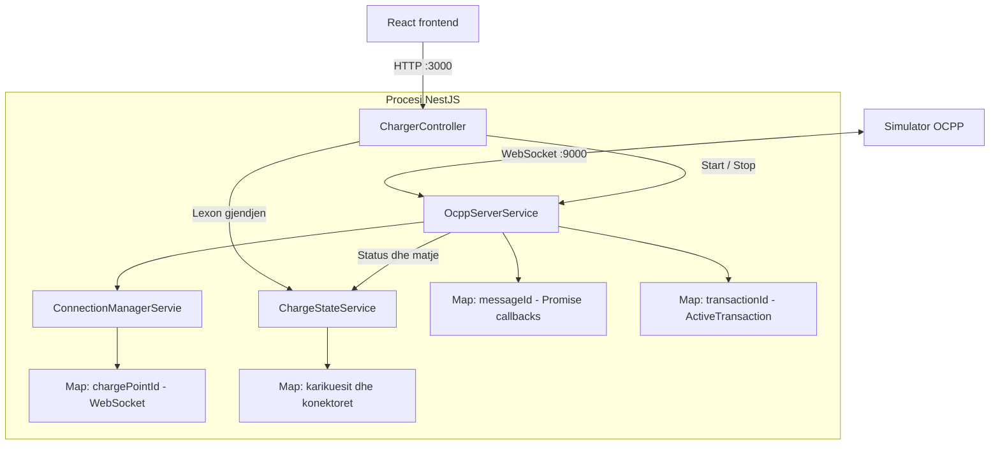

Emri `ConnectionManagerServie` ne diagram eshte ai qe gjendet aktualisht ne kod. Ky service ruan referencat e socket-eve; `ChargeStateService` ruan gjendjen qe do te ekspozohet ne API. Nje WebSocket nuk serializohet per frontend-in.

| Komponenti | Pergjegjesia aktuale | Kufizimi |
| --- | --- | --- |
| `ChargerController` | Listim, detaje, start dhe stop | Nuk kontrollon identitetin ose te drejtat e perdoruesit |
| `OcppServerService` | Pranon lidhje, dergon/perpunon frames, mban tranzaksionet | Transporti dhe logjika e seancave jane ne nje service |
| `ConnectionManagerServie` | Gjen socket-in nga ID-ja e karikuesit | Map lokal per nje proces |
| `ChargeStateService` | Gjendja e konektoreve dhe matja me e fundit | Pa histori ose database |
| `OcppActionMap` | Lidh action me tipin request/response | TypeScript nuk validon JSON ne runtime |

Referencat ne projekt: [serveri OCPP](backend/src/ocpp/ocpp-server.service.ts), [connection manager](backend/src/ocpp/connection-manager.service.ts), [gjendja](backend/src/ocpp/charger-state.service.ts), [controller-i](backend/src/charger/charger.controller.ts), [tipet](backend/src/ocpp/ocpp.types.ts).

Frontend-i i proves lexon `GET /chargers` cdo 2 sekonda, pa nisur nje kerkese tjeter nese e meparshmja eshte ende pending. Ky polling nuk ndryshon frekuencen e MeterValues qe dergon pajisja. Komandat start/stop presin pergjigjen OCPP brenda kerkeses HTTP; kerkesat ne pritje ruhen vetem ne memorie.

| Endpoint aktual | Input | Rezultati |
| --- | --- | --- |
| `GET /chargers` | Pa body | Karikuesit e njohur nga procesi, perfshire te shkeputurit |
| `GET /chargers/:id` | ID ne URL | Gjendja e nje karikuesi dhe konektoret |
| `POST /chargers/:id/start` | `idTag`, opsionalisht `connectorId` | Pergjigjja e RemoteStartTransaction |
| `POST /chargers/:id/connector/:connector/stop` | ID dhe konektori ne URL | Kerkohet tranzaksioni aktiv dhe dergohet RemoteStopTransaction |

Route-i stop perdor konektorin, jo nje `transactionId` te derguar nga UI-ja. Kjo ul informacionin qe duhet te menaxhoje klienti, por backend-i duhet te siguroje qe seanca e gjetur i perket perdoruesit qe po ben kerkesen.

`OcppModule` eksporton service-t per `ChargerModule`. Serveri perdor direkt `WebSocketServer` nga `ws`. Pending requests kane Promise callbacks dhe kontroll te socket-it; timeout-i lokal eshte 10 sekonda. Te dhenat e karikuesve, tranzaksioneve dhe matjeve humbasin ne restart.

MeterValues ruan vetem grupin me timestamp me te ri per konektor. Nuk ruhet ende historia ose snapshot i pavarur per secilin measurand. Nese matjet vijne para StatusNotification, konektori krijohet me gjendje `Unknown`; statusi pasues bashkohet me te dhenat ekzistuese. UI-ja shfaq timestamp-in e matjes vecmas kohes se statusit.

### 10.5 Screenshot-et e implementimit prove


Figura 1: evidenca ekzistuese tregon URL-ne `/ocpp/CP_001`, protokollin dhe frame-in hyres. Nuk provon autentikim te pajisjes.


Figura 2: ne screenshot shihet `Accepted`, `currentTime` dhe `interval: 60`. Kodi aktual kthen `interval: 10`; figura dokumenton nje version te meparshem. Log-u i shkeputjes ne fund nuk mjafton per te percaktuar shkakun e saj.


Figura 3: shihen `idTag: TEST`, `connectorId: 1`, `meterStart` dhe timestamp-i i StartTransaction. Pranimi i `TEST` nga kodi aktual eshte sjellje prove, jo autorizim real.


Figura 4: shihen mesazhe periodike MeterValues dhe fusha si energjia, fuqia dhe SoC. Kjo figure provon marrjen/logimin ne ate faze; nuk provon ruajtjen ne database ose shfaqjen ne frontend-in e ri.

## 11. Testimi dhe Problemet e Hasura

### 11.1 Probleme te dokumentuara gjate zhvillimit

Keto vijne nga shenimet e meparshme te projektit dhe nga ndryshimet e bera gjate zhvillimit. Nuk jane te gjitha bug-e qe vazhdojne te jene aktive.

| Problemi | Shkaku / mesimi | Gjendja |
| --- | --- | --- |
| Serveri WebSocket inicializohej dy here dhe zinte te njejtin port | Service-i duhet te kete nje instance te perbashket ne modul | I dokumentuar ne backend/NOTES.md; wiring aktual eksporton service-t nga OcppModule |
| Dergimi i komandes trajtohej sikur ishte edhe rezultati | WebSocket send nuk eshte pergjigje OCPP | Tani ka Promise dhe pendingRequests me messageId |
| CALL-e pa pergjigje bllokonin rrjedhen e pritur | Klienti pret CALLRESULT ose CALLERROR | Veprimet e implementuara pergjigjen; action-et e panjohura mbeten problem |
| Fusha e kohes ne BootNotification ishte shkruar `currenTime` | Typo ne payload | Kodi aktual perdor `currentTime` dhe `interval` |
| Connector Map nuk eshte JSON array | Strukturat e memories ndryshojne nga DTO-t e API-se | Controller-i perdor Array.from per konektoret |
| StatusNotification mund te zevendesonte te gjithe objektin e konektorit | Do te humbnin matjet e ruajtura | updateConnector bashkon gjendjen e vjeter me statusin e ri |

Zgjedhja e transportit ishte gjithashtu e rendesishme: OCPP 1.6-J ne kete projekt perdor WebSocket standard. Socket.IO shton nje protokoll te vetin dhe nuk eshte zevendesim transparent per kete lidhje.

### 11.2 Bug kritik: key i gabuar per tranzaksionin

Ne `StartTransaction` kodi aktual ben:

```typescript
const transactionId = this.transactionId++;
this.transactions.set(this.transactionId, {
  transactionId: transactionId,
  // ...
});
```

`transactionId` lokal ka vleren e vjeter, ndersa `this.transactionId` eshte rritur. Tranzaksioni i pare dergohet si ID `0`, por ruhet nen key `1`. `getActiveTransaction` mund ta gjeje sepse kontrollon vlerat e Map-it; `StopTransaction` perdor `delete(request.transactionId)` dhe nuk e fshin entry-n e sakte.

Riprodhimi i izoluar i ketyre operacioneve gjate pergatitjes se dokumentit dha:

```json
{"sentTransactionId":0,"storedMapKey":1,"deleteBySentId":false,"remainingTransactions":1}
```

Ky eshte rezultat real i nje prove te vogel te logjikes, jo log i nje karikuesi fizik. Me disa seanca pasoja mund te jete edhe fshirja e nje entry-je tjeter qe rastis te kete ate key. Permiresimi eshte perdorimi i se njejtes ID lokale ne Map, ne objekt dhe ne pergjigje. Duhet testuar cikli start-stop-start dhe dy konektore/paralelizmi. Kodi nuk eshte ndryshuar si pjese e ketij dokumenti.

### 11.3 Bug: NotFoundException kthehet si rezultat normal

Ne route-in stop gjendet:

```typescript
return new NotFoundException(`No active transactions on ${id}`);
```

Nje exception duhet hedhur me `throw` qe te trajtohet nga shtresa e gabimeve te NestJS. Me `return`, objekti trajtohet si rezultat dhe route-i ka `@HttpCode(200)`. Frontend-i ka nje kontroll shtese per kete forme, por kontrata HTTP mbetet e gabuar. [Trajtimi i exceptions ne NestJS](https://docs.nestjs.com/exception-filters).

Permiresimi i propozuar eshte HTTP 404 per mungesen e seances dhe nje forme e qendrueshme e gabimit. Duhet kontrolluar veçmas edhe karikuesi i panjohur dhe konektori i pavlefshem.

### 11.4 Probleme te tjera te hapura nga leximi i kodit

| Gjetja | Pasoja | Cfare duhet bere |
| --- | --- | --- |
| Counter lokal per transactionId | Riperdorim ID-sh pas restart-it ose midis instancave | Gjenerim persistent dhe i koordinuar |
| `Authorize` dhe StartTransaction pranojne gjithmone | Cdo idTag mund te perdoret ne prove | Policy reale per idTag/perdorues/seance |
| `StopTransaction` fshin vetem sipas ID-se | Nuk verifikohet qe seanca i perket pajisjes qe e dergoi | Kontroll i chargePointId dhe ruajtje e mbylljes |
| Nuk ka default ne switch per action-e te panjohura | CALL mbetet pa pergjigje | CALLERROR i pershtatshem per action te pambeshtetur |
| Payload-et perdorin type assertions | Input i gabuar mund te prishe handler-in | Schema validation ne runtime |
| `StopTransaction.response` lidhet me tipin RemoteStopTransactionResponse | Tipi kerkon status, por handler-i dergon `{}` | Tip i vecante dhe perputhje action-response |
| `sendCallResult` shpesh thirret pa action specifik | Union i gjere mund te mos kape payload-in e gabuar | Lidhje me e forte e handler-it me action-in |
| Status/error unions jane te paplota | P.sh. simulatori dergon `Finishing`, i cili mungon ne union | Perputhje me skemen OCPP, pa pretenduar validim nga cast-i |
| Timer-i i komandes nuk anulohet pas pergjigjes | Callback mbetet deri ne 10 sekonda, pastaj nuk ben pune | Per ngarkese me te madhe, lifecycle i qarte i pending requests |
| Mbyllja e socket-it nuk refuzon menjehere pending requests | HTTP pret deri ne timeout | Politike e dokumentuar per disconnect dhe rezultat te pasigurt |
| `socket.send` nuk trajton callback-un e gabimit | Deshtimi i transportit mund te shihet vetem si timeout | Trajtim i send failure pa e ngaterruar me refuzim biznesi |
| Lidhja e re zevendeson Map-in, por e vjetra mbetet aktive | Lidhja e vjeter mund te dergoje ende CALL qe ndryshojne gjendjen | Kontroll i lidhjes aktive dhe mbyllje e asaj te vjeter |
| URL ndahet vetem me `split('/')` | Query string ose path i gabuar mund te behet pjese e identitetit | Parsing i URL-se dhe validim i endpoint-it |
| Timestamp i pavlefshem ose shume ne te ardhmen | Mund te bllokoje zgjedhjen e matjeve te reja | Validim kohe, receivedAt dhe trajtim i clock drift |
| Nuk ruhet historia e matjeve | Nuk rindertohet grafiku ose auditimi i nje seance | Persistence dhe retention policy |
| UI shfaq `Reading` dhe njesi bosh kur mungojne fushat | Paraqitja nuk normalizon default-et e protokollit | Normalizim sipas skemes perpara llogaritjeve |

Keto jane gjetje nga inspektimi i kodit. Pervec riprodhimit te izoluar te key-t te tranzaksionit, nuk pretendohet qe secila u riprodhua ne nje prove end-to-end gjate shkrimit te dokumentit.

### 11.5 Cfare duhet testuar

Ne gjendjen e inspektuar, testi unit i ruajtur ne `backend/src` kontrollon `Hello World!`. Edhe testi e2e ekzistues mbulon route-in baze. Kjo nuk perben mbulim te rrjedhave OCPP. Build-i ose nje screenshot i suksesshem nuk verteton menaxhimin e deshtimeve.

| Prova | Rezultati qe duhet kontrolluar |
| --- | --- |
| BootNotification | ID e njejte ne pergjigje; currentTime, interval dhe status ne formen e duhur |
| Remote start me Accepted dhe Rejected | Rezultati i sakte per klientin; pa shpallur seancen aktive vetem nga Accepted |
| Dy komanda me pergjigje ne rend te kundert | Secila Promise merr pergjigjen e vet |
| CALLRESULT nga socket tjeter | Nuk zgjidh kerkesen e lidhjes origjinale |
| Start → Stop → Start | Seanca e pare mbyllet sakte dhe e dyta ka ID te re |
| MeterValues para StatusNotification | Nuk humbet matja dhe konektori krijohet ne menyre te kontrolluar |
| Matje te vjetra / te njejta / kohe e pavlefshme | Nuk korruptojne snapshot-in |
| Stop pa seance | HTTP 404 pas rregullimit, jo HTTP 200 me objekt error |
| Disconnect dhe reconnect me te njejtin ID | Close nga socket-i i vjeter nuk heq lidhjen e re |
| Timeout dhe pergjigje e vonuar | Pa pending entries te mbetura dhe pa retry te verber |
| Dy perdorues dhe nje seance | Vetem pronari/operatori i autorizuar mund ta ndaloje |
| Dy karikues me te njejtin transactionId te pretenduar | Njeri nuk ndryshon seancen e tjetrit |
| Restart gjate karikimit | Pas persistence/reconciliation, seanca rikuperohet |
| Ngarkese me shume karikues | Matje e latences, memories, event loop lag dhe humbjes se mesazheve |

Provat me simulator duhen ndjekur nga prova me pajisje reale dhe kontroll ndaj skemave OCPP. Simulatori aktual ka nje fallback qe gjeneron nje transactionId kur mungon ne pergjigje; kjo mund te fshehe nje pergjigje te gabuar te backend-it. Prandaj funksionimi i simulatorit nuk eshte prove e perputhshmerise se plote me protokollin.

## 12. Cfare Mungon per Production

Perpara perdorimit real do te perqendrohesha te keto hapa:

1. Te funksionoje sakte cikli start-stop-start dhe te rregullohen bug-et e dokumentuara.
2. Te kete login dhe kontroll qe perdoruesi mund te veproje vetem mbi seancen e tij.
3. Te ruhen seancat ne PostgreSQL dhe te provohet cfare ndodh pas restart-it.
4. Te kontrollohen payload-et dhe identiteti i karikuesit, me komunikim te enkriptuar.
5. Te provohen shkeputjet, timeout-et dhe disa perdorues/karikues njekohesisht.

Me pas do te diskutoja me ekipin ngarkesen e pritshme, ruajtjen e historise dhe nevojen per disa instanca. Nuk e konsideroj ende te zgjidhur menyren si do te rikuperohen te gjitha seancat pas nje deshtimi ose si do te drejtohen komandat midis serverave.

## 13. Perfundime dhe Hapat e Radhes

Projekti tregon se nje backend mund te sherbeje si ura midis nje aplikacioni HTTP dhe karikuesve me lidhje te vazhdueshme OCPP. Ndarja midis connection manager, gjendjes se karikuesve dhe handler-it OCPP e ben rrjedhen me te kuptueshme.

Puna qe mbetet perqendrohet te saktesia e seancave dhe deshtimet e rrjetit. Backend-i duhet te dije kush e nisi nje seance, cilit konektor i perket, nese komanda u pranua, nese veprimi ndodhi realisht dhe si te sillet kur informacioni mungon. Persistence dhe autorizimi jane te nevojshme perpara se sistemi te perdoret nga perdorues reale.

Hapi me i vlefshem pas demonstrimit eshte te perfundohet dhe testohet nje cikel i besueshem start-stop-start, pastaj te ruhet ky cikel ne database. Arkitektura me disa instanca duhet te ndertohet mbi kete baze, jo te fshehe problemet e saktesise qe ekzistojne sot.

## 14. Pergatitja per Neser

### 14.1 Plan studimi me prioritet

Nese kam rreth 3 ore ne dispozicion, do t'i ndaja keshtu:

| Koha | Tema | Ushtrimi konkret |
| --- | --- | --- |
| 35 minuta | OCPP frames dhe rrjedha e seances | Vizatoj pa shenime Boot → RemoteStart → StartTransaction → MeterValues → RemoteStop → StopTransaction |
| 30 minuta | Kodi i backend-it dhe bug-et | Shpjegoj sendCall, Promise, pendingRequests dhe riprodhoj ne leter gabimin e transactionId |
| 30 minuta | Autentikim dhe autorizim | Shpjegoj pse login, idTag, ID-ja ne URL dhe CORS kane role te ndryshme |
| 30 minuta | Bazat e databazes | Vizatoj tabelat dhe lidhjet e tyre; shpjegoj cfare duhet te ruhet pas nje restart-i |
| 25 minuta | Kufizimet e arkitektures | Vizatoj dy instanca dhe shpjegoj problemin kur socket-i eshte ne njeren dhe kerkesa HTTP ne tjetren |
| 30 minuta | Prova e prezantimit | Kaloj demonstrimin, pergatis screenshot-et qe mungojne dhe shpjegoj kufizimet pa pretenduar production readiness |

Nese kam vetem 45 minuta: 15 minuta rrjedha start/stop, 10 minuta dy bug-et konkrete, 10 minuta autorizimi dhe 10 minuta problemi i dy instancave. Keto lidhen direkt me projektin dhe kane me shume vlere per neser sesa te mesoj te gjitha komandat OCPP ose nje platforme deployment-i nga fillimi.

### 14.2 Pyetje qe duhet t'u pergjigjem pa lexuar kodin

1. **Pse WebSocket?** Karikuesi hap nje lidhje te vazhdueshme dhe te dyja palet mund te nisin komanda; backend-i nuk ka nevoje te hape nje lidhje te re drejt pajisjes per cdo veprim.
2. **Pse nuk lidhet frontend-i direkt me karikuesin?** Backend-i duhet te zbatoje kontrollin e aksesit, te mbaje seancat dhe te koordinoje komunikimin.
3. **A do te thote Accepted qe makina po karikohet?** Jo. Duhet te ndiqen StartTransaction, statuset dhe matjet.
4. **Cili eshte ndryshimi mes messageId dhe transactionId?** I pari perputh CALL me pergjigjen; i dyti identifikon tranzaksionin OCPP.
5. **Cfare ndodh pas nje timeout-i?** Backend-i nuk mori pergjigje ne kohe; rezultati fizik mund te jete ende i panjohur.
6. **Pse nuk mjafton nje retry?** Komanda mund te jete ekzekutuar; duhet kontrolluar gjendja perpara se te dergohet perseri.
7. **Cfare humbet ne restart sot?** Socket-et, gjendja, seancat, pending requests dhe counter-i lokal.
8. **Pse nuk mjafton nje database e perbashket per dy backend-e?** Ajo ndan te dhenat, por socket-i mbetet ne procesin qe ka lidhjen me karikuesin.
9. **Pse nuk mjafton login-i?** Identifikon perdoruesin, por duhet kontrolluar edhe nese seanca i perket atij.
10. **Si provohet qe sistemi shkallezohet?** Me load tests dhe metrika; numri i Map-eve ose perdorimi i Node.js nuk jane benchmark.
11. **Cfare provon simulatori?** Rrjedhen e implementuar me ate simulator, jo sjelljen e cdo karikuesi ose certifikim OCPP.
12. **Cfare do te ndryshoja fillimisht?** Bug-u i tranzaksionit dhe kontrata stop, pastaj autorizimi dhe persistence.

### 14.3 Rradha e demonstrimit

1. Hap diagramin e arkitektures aktuale dhe shpjego dy portat: HTTP dhe OCPP.
2. Lidh simulatorin me `ws://localhost:9000/ocpp/CP_001` dhe `ocpp1.6`.
3. Trego BootNotification dhe nje CALLRESULT me te njejten ID.
4. Hap frontend-in, kontrollo qe origin-i perputhet me CORS-in dhe nis nje seance.
5. Trego diferencen mes Accepted, StartTransaction dhe matjeve ne UI.
6. Kerko stop dhe krahaso ID-te. Shpjego bug-un e hapur nese nuk eshte rregulluar perpara demonstrimit.
7. Mbyll me diagramin e dy instancave dhe pyetjet qe ka lene te hapura arkitektura.

Per rezervë, mbaj screenshot-et ekzistuese dhe shto pamjet e UI-se/stop-it. Nese demo live deshton, shpjego hapin ku ndaloi dhe log-un perkates; mos e paraqit screenshot-in historik si prove te versionit aktual.

### 14.4 Burime per studim

- Per versionet dhe kufirin CP–CMS: [Open Charge Alliance — OCPP](https://openchargealliance.org/protocols/open-charge-point-protocol/).
- Per frame-et dhe payload-et: specifikimi dhe JSON schemas OCPP 1.6-J qe perdor projekti; krahasoji me `OcppActionMap`, sidomos StartTransaction dhe StopTransaction.
- Per sigurine e pajisjes: [OCPP 1.6 Security Whitepaper](https://openchargealliance.org/ocpp-info-whitepapers/ocpp-1-6-security-whitepaper-4th-edition/).
- Per kontrollin e aksesit HTTP: [NestJS Authorization](https://docs.nestjs.com/security/authorization).
- Per `throw` dhe status codes: [NestJS Exception filters](https://docs.nestjs.com/exception-filters).
- Per lifecycle te socket-it, upgrade, ping/pong dhe close: [ws API](https://github.com/websockets/ws/blob/master/doc/ws.md).
- Per dallimin mes tipit dhe validimit: [TypeScript Type Assertions](https://www.typescriptlang.org/docs/handbook/2/everyday-types.html#type-assertions).

Burimi kryesor per sjelljen e proof of concept mbetet kodi i ketij repository. Arkitektura e propozuar eshte nje pike fillestare per diskutim. Disa vendime jane te thjeshta dhe te arsyetuara, ndersa problemet me te veshtira jane lene si pyetje per studim dhe konsultim me ekipin. Ajo nuk paraqet funksionalitete te realizuara ne proof of concept.
