## 1. Permbledhje

Ky kerkim trajton ndertimin e nje sistemi per menaxhimin remote te stacioneve te karikimit per makinat elektrike. Per te provuar komunikimin eshte ndertuar nje proof of concept me NestJS, React dhe nje simulator OCPP. Backend-i pranon lidhje WebSocket, perpunon nje subset te OCPP 1.6-J, dergon komanda start/stop dhe ekspozon statuset dhe leximet e metrit per aplikacionin.

Rezultati kryesor eshte nje ndarje midis kerkeses se perdoruesit, komandes OCPP dhe ngjarjes qe raporton karikuesi. Pranimi i nje komande nuk provon qe makina ka filluar ose perfunduar karikimin. Kjo gjendje duhet ndjekur nga mesazhet e karikuesit dhe nga seanca e ruajtur ne backend.

Implementimi aktual mban te dhenat vetem ne memorie. Ai demonstron rrjedhen e komunikimit, por nuk ka ende autentikim, autorizim mbi seancat, persistence ose koordinim midis disa instancave. Keto kufizime, bashke me bug-et konkrete, analizohen ne seksionet ne vazhdim.

Shenim mbi strukturen: seksionet nga Proposed Architecture deri te Security trajtojne nje arkitekture fillestare per nje sistem qe synon perdorim real, bashke me kufizimet dhe pyetjet qe kerkojne studim te metejshem. Proof of Concept dhe seksionet pas tij dokumentojne implementimin prove, evidencen dhe kufizimet e tij. Screenshot-et jane nga fazat e zhvillimit dhe nuk vertetojne automatikisht sjelljen e versionit aktual.

## 2. Konstatimi i Problemit dhe Kuadri

### 2.1 Problemi

Objektivi i ketij kerkimi eshte te investigoj arkitekturen dhe teknologjite te nevojshme per krijimin e nje sistemi te afte per te menaxhuar ne menyre remote stacionet e karikimit per makinat elektrike.

Perdorimi paresore i konsideruar eshte nje perdorues i cili lidh makinen e tij elektrike ne nje stacion karikimi dhe fillon ose terminon karikimin e makines se tij nepermjete nje aplikacioni.

Per kete arsye sistemit i nevojitet komunikim midis dy domaineve te ndryshme: Nje aplikacion per perdoruesin dhe nje infrastrukture fizike per karikimin e makinave elektrike.

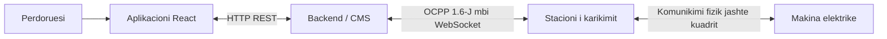

####  2.1.1 Objektivat

Kerkimi do te vendosi:

- Se si stacionet e karikimit per makinat elektrike komunikojne me sistemet qendrore (CMS).
- Cili protokoll komunikimi duhet perdorur.
- Si te performohen veprimet 'remote'.
- Si duhet te prezantohen statuset dhe seancat e karikimit.
- Si duhet te komunikoj backend-i me stacionet e karikimit dhe aplikacionin e perdoruesit.
- Si duhet shkallezuar arkitektura per te akomoduar me shume stacione karikimi ose me shume perdorues.
- Si te adresohen shqetesimet mbi besueshmerine dhe sigurine e sistemit.

#### 2.1.2 Kuadri

Ne kuader te kerkimit:

- OCPP communication
- Charger connection management
- Charger status
- Remote start
- Remote stop
- Charging sessions
- Meter readings
- Backend architecture
- Client/backend interaction
- Persistence
- Security considerations
- Scaling considerations

Jashte kuadrit te kerkimit:

- Payment processing
- Billing
- Physical charger installation
- Vehicle-side communication protocols
- Production deployment

## 3. Kerkesat

### 3.1 Kerkesat Funksionale

| ID    | Kerkesa                                                                                                        |
| ----- | -------------------------------------------------------------------------------------------------------------- |
| KF-01 | Sistemi duhet te pranoj stacione karikimi te lidhura.                                                          |
| KF-02 | Sistemi duhet te mbaj mend/ruaj statusin aktual te cdo konektori ne nje stacion karikimi.                      |
| KF-03 | Perdoruesi duhet te kete mundesin te kerkoj ne menyre remote fillimin e nje seance karikimi per makinen e tij. |
| KF-04 | Perdoruesi duhet te kete mundesin te kerkoj ne menyre remote mbylljen e nje seance karikimi per makinen e tij. |
| KF-05 | Sistemi duhet te pranoj informacion mbi seancen e karikimit nga stacioni i karikimit.                          |
| KF-06 | Sistemi duhet te pranoj lexime te metrit te karikimit gjate seances se karikimit.                              |
| KF-07 | Aplikacioni duhet te shfaq statusin aktual te karikuesit/secionit te karikimit.                                |

### 3.2 Kerkesat Jo-funksionale

| Kategoria                  | Kerkesa                                                                                           |
| -------------------------- | ------------------------------------------------------------------------------------------------- |
| Siguria (Security)         | Komunikimi midis karikuesit dhe perdoruesit duhet te jene te authentikuara dhe enkriptuara.       |
| Besueshmeria (Reliability) | Nderprerjet e karikuesit dhe timeout-te te komandave duhet te menaxhohen ne menyre te sigurte.    |
| Shkallezimi (Scalability)  | Arkitektura duhet te suportoje ne menyre te njehkohsishme lidhjen e disa stacioneve te karikimit. |
| Vazhdimesi (Persistence)   | Seancat e karikimit duhet t'ju mbijetojne restarteve te backend-it.                               |
| Observimi (Observability)  | Evente ose komanda te rendesishme duhet te logohen.                                               |

## 4. Kerkim mbi OCPP

### 4.1 Cfare eshte OCPP?

OCPP (Open Charge Point Protocol) eshte nje standart komunikimi i cili lejon stacionet e karikimit te makinave elektrike te komunikojne me software menaxhimi qendrore (CMS), pavaresisht se kush i ka krijuar.

### 4.2 Justifikimi i ekzistences

Para krijimit te nje protokollit standart, cdo prodhues i stacioneve te karikimit per makinat elektrike krijonte versionin e tij te nje protokolli komunikimi. Keshtu, cdo stacion karikimi mund te komunikonte vetem me backend-in e tij personal. Kjo metod krijon disa probleme:

- Operatoret ishin te lidhur me ekosistemin e vetem nje prodhuesi, si ne aspektin e hardware, si edhe ne software.
- Te operoje nje rrjete komunikimi midis disa stacioneve karikimi te llojeve te ndryshme ishte praktikisht e pamundur.
- Cdo modeli karikimi kerkonte zhvillimin e nje protokolli personal, qe rriste kostot.
- Ne keto sisteme te mbyllura zhvillimi ishte teper i avashte, dhe si rrjedhoje zhvillimi i industrise ishte gjithashtu i avashte.

### 4.3 Versionet e OCPP

Versionet kryesore te ofruara aktualisht nga Open Charge Alliance jane OCPP 1.6, OCPP 2.0.1 dhe OCPP 2.1. Ekzistojne edhe versione me te vjetra. OCPP 1.6 mbetet gjeresisht i perdorur; OCPP 2.0.1 zgjeron menaxhimin e pajisjeve, sigurine dhe trajtimin e tranzaksioneve. OCPP 2.1 eshte publikuar ne 2025 dhe shton, midis te tjerash, funksionalitete per karikim bidireksional. OCPP 1.6 dhe 2.0.1 nuk jane kompatibel ne protokoll. [Burimi: Open Charge Alliance](https://openchargealliance.org/protocols/open-charge-point-protocol/).

Ne projektin shembull eshte perdorur OCPP 1.6-J me JSON. Kjo zgjedhje pershtatet me simulatorin dhe me kerkesat e remote start/stop. OCPP 1.6 ka edhe variant SOAP, por backend-i i ketij projekti implementon vetem komunikimin JSON mbi WebSocket.

Zgjedhja ne production duhet te varet nga pajisjet konkrete, kerkesat funksionale dhe profili i sigurise. Mbeshtejtja e Plug & Charge lidhet edhe me komunikimin e makines me karikuesin dhe me menaxhimin e certifikatave; nuk arrihet vetem duke ndryshuar nje string versioni ne backend.

#### 4.3.1 Komunikimi

OCPP -> WebSocket -> TCP/IP
OCPP operon ne baze te nje arkitekture klient-server ku stacioni i karikimit sillet si klienti, ndersa CMS sillet si serveri. Komunikimi midis tyre funksionon nepermjete nje lidhjeje te vazhdueshme me WebSocket, duke lejuar keshtu dergim te mesazheve ne te dyja drejtimet.
Stacioni i karikimit e nis perpjekjen per te hapur nje lidhje websocket me CMS-in, i cili me pas duhet ta pranoj.

##### 4.3.1.1 URL i lidhjes

Per te nisur nje lidhje websocket, stacioni i karikimit i duhet nje URL ku te lidhet. Kjo URL permban 'identitetin' e atij stacioni karikues per t'i treguar CMS-it se me cilin stacion po krijon lidhje. Per kete arsye cdo stacion karikimi ka URL-in e tij specifik, identifikues.

CMS-i duhet te ofroje te pakten nje *OCPP endpoint URL*, prej te ciles stacioni i karikimit te derivoj URL-n e saj te lidhjes.

Per te derivuar URL-n e saj, stacioni i karikimit modifikon URL e ofruar nga CMS duke i shtuar fillimisht nje '/' dhe me pas nje *string* qe e identifikon ate.
Pershembull, per nje stacion karikimi me identitet 'SK001', i cili po perpiqet me nje CMS me URL: 'ws://cms.shembull.com/ocpp', URL-i i lidhjes do te ishte i tille:
'ws://cms.shembull.com/ocpp/SK001'

Versioni ekzakte i OCPP ne perdorim duhet specifikuar ne nje header 'Sec-Websocket-Protocol'

##### 4.3.1.2 Pergjigja e Serverit

Pas marrjes se kerkeses CMS-i negocion lidhjen dhe versionin. Ne arkitekturen e synuar identiteti duhet kontrolluar kundrejt regjistrit te karikuesve dhe kredencialeve te tyre, perpara se pajisja te lejohet te komunikoje.

Ne kodin aktual kontrollohet vetem qe segmenti i fundit i URL-se te mos jete bosh. Cdo identitet i ri regjistrohet ne memorie. Pra `/ocpp/CP_001` identifikon pajisjen qe pretendon klienti.

#### 4.3.2 Mesazhet OCPP

##### 4.3.2.1 Llojet e mesazheve

OCPP perdor nje protokoll personal mbi Websocket ne menyre qe te identifikoj se cilat mesazhe jane 'requests' dhe cilat 'responses'. Per kete arsye, mesazhet e derguara jane tre llojesh:

| Lloji i mesazhit | Numri | Drejtimi |
| --- | --- | --- |
| CALL | 2 | CP → CMS ose CMS → CP |
| CALLRESULT | 3 | Ne drejtimin e kundert te CALL perkates |
| CALLERROR | 4 | Ne drejtimin e kundert te CALL perkates |

Stacioni mbetet klienti WebSocket, por te dyja palet mund te dergojne CALL. Pershembull, `BootNotification` niset nga karikuesi, ndersa `RemoteStartTransaction` nga CMS-i. ID-ja lidh kerkesen me pergjigjen. Ne kete projekt numrat e panjohur te mesazheve nuk perpunohen.

##### 4.3.2.2 ID e Mesazhit

ID-ja e Mesazhit sherben per te identifikuar nje kerkese. Kjo ID duhet te jete ndryshe per cdo mesazh CALL qe nje stacioni dergon ne po te njejtin lidhje WebSocket. ID-ja e nje pergjigjeje CALLRESULT ose CALLERROR duhet te jete e **njejte** me kerkesen CALL per te cilen po pergjigjet.

##### 4.3.2.3 Formati i mesazhit

###### Call

Nje mesazh *CALL* perfshin 4 (kater) elemente:

```
[<MessageTypeId>, "<UniqueId>", "<Action>", {<Payload>}]
```

Ku:

| Fusha    | Kuptimi                                                                           |
| -------- | --------------------------------------------------------------------------------- |
| UniqueId | Identifikuese unik i cili do te perdoret per te perputhur kerkesen me pergjigjen. |
| Action   | Emri i procedures (string)                                                        |
| Payload  | Nje JSON i cili permban argumented e nevojshme per proceduren 'Action'            |
Pershembulll, nje kerkes *BootNotification* do te dukej keshtu:

```
[
2,
"123456",
"BootNotification",
	{
		"chargePointVendor":"VendorX", "chargePointModel":"SingleSocketCharger"
	}
]
```

###### CallResult

Nese kerkesa *CALL* procesohet me sukses, pergjigjia do te jete nje *CALLRESULT*, i cili duket i tille:

```
[<MessageTypeId>, "<UniqueId>", {<Payload>}]
```

Ku:

| Fusha    | Kuptimi                                                                     |
| -------- | --------------------------------------------------------------------------- |
| UniqueId | Duhet te i njejti ID qe eshte ne kerkesen CALL.                             |
| Payload  | Nje objekt JSON qe permban rezultatet e ekzekutimit te procedures 'Action'. |
Pershembull, nje pergjigje *BootNotification* do te dukej e tille:

```
[
3,
"123456",
{
"status":"Accepted", "currentTime":"2013-02-01T20:53:32.486Z", "interval":300
}
]
```

###### CallError

CALLERROR raporton nje gabim ne perpunimin e nje CALL, pershembull nje action te pambeshtetur ose nje payload te pavlefshem. Refuzimi normal i nje komande mund te jete nje CALLRESULT me `status: "Rejected"`. Keto dy raste duhen dalluar nga humbja e lidhjes ose timeout-i lokal, ku mund te mos vije fare nje pergjigje.

```text
[4, "<UniqueId>", "<errorCode>", "<errorDescription>", {<errorDetails>}]
```

Shembull ilustrues per nje action qe backend-i nuk e implementon:

```json
[4, "req-unknown-1", "NotImplemented", "Action not supported", {}]
```

Backend-i aktual trajton CALLERROR per komandat qe ka derguar vete. Mungon ende gjenerimi sistematik i CALLERROR per CALL-et hyrese te pambeshtetura ose me payload te pavlefshem.

#### 4.3.3 Komanda OCPP me interes

Ne projektin prove eshte implementuar nje subset i komandave OCPP:

| Komanda                | Drejtimi       | Qellimi                                                  |
| ---------------------- | -------------- | -------------------------------------------------------- |
| BootNotification       | Karikues → CMS | Regjistron nje stacion karikimi                          |
| Heartbeat              | Karikues → CMS | Sinjalizon qe stacioni i karikimit eshte ende funksional |
| StatusNotification     | Karikues → CMS | Raporton gjendjen/statusin e stacionit te karikimit      |
| RemoteStartTransaction | CMS → Karikues | Kerkon fillesen e karikimit 'remote'                     |
| StartTransaction       | Karikues → CMS | Raporton fillesen aktuale te tranzaksionit               |
| MeterValues            | Karikues → CMS | Raporton matje                                           |
| RemoteStopTransaction  | CMS → Karikues | Kerkon mbylljen e karikimit 'remote'                     |
| StopTransaction        | Karikues → CMS | Raporton perfundimin e tranzaksionit                     |
| Authorize | Karikues → CMS | Kerkon autorizimin e nje idTag |

## 5. Arkitektura e Propozuar

Per kete sistem do te nisja me nje arkitekture te thjeshte: nje aplikacion klient, nje backend NestJS dhe nje databaze PostgreSQL. Backend-i do te komunikoje me aplikacionin permes HTTP dhe me stacionet e karikimit permes OCPP mbi WebSocket.

Kjo ndarje me duket e mjaftueshme per te kuptuar dhe implementuar rrjedhen kryesore: perdoruesi kerkon karikimin, backend-i kontrollon kerkesen dhe ia dergon karikuesit, pastaj ruan dhe shfaq pergjigjet e tij. Fillimisht do te perdorja nje instance backend-i. Ndarja ne disa servera do te kerkoje studim te metejshem.

Propozimi eshte nje pike fillestare per nje aplikacion qe synon perdorim real. Ai perfshin nevojat baze, por nuk zgjidh ende te gjitha rastet e deshtimit ose te ngarkeses se larte. Ne seksionet me poshte kam lene edhe pyetje qe do te diskutoja perpara nje implementimi production.

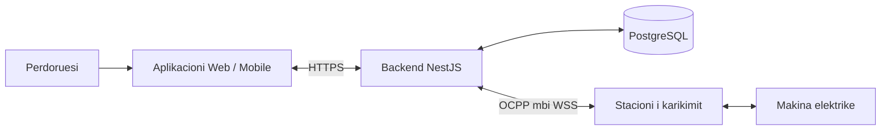

### 5.1 Aplikacioni Klient

Aplikacioni duhet t'i lejoje perdoruesit te beje login, te shohe stacionet e disponueshme dhe te zgjedhe nje konektor. Pas lidhjes se makines, perdoruesi mund te kerkoje fillimin ose ndalimin e karikimit.

Ne UI do te shfaqja statusin e konektorit, seancen aktive dhe matjet e fundit qe ka raportuar karikuesi. Do te shfaqja gjithashtu kohen e perditesimit, sepse nje matje e vjeter nuk duhet te duket sikur eshte marre se fundmi.

Nje gje qe duhet te dallohet ne UI eshte “kerkesa u pranua” nga “karikimi filloi”. Per kete arsye, pas shtypjes se Start do te shfaqja nje gjendje pritjeje derisa te vije informacion nga karikuesi.

Per perditesimin e gjendjes do te nisja me polling, pershembull nje kerkese cdo 2 sekonda kur perdoruesi ka hapur seancen. Kjo eshte e thjeshte per t'u implementuar. 

Ne konsiderate duhet marre shpeshtesia e perditesimit te matjeve. Mund te imagjinojme qe per nje numer te madhe perdoruesish ne te njejten kohe numri i requesteve qe godasin backend-in cdo sekond do te ishte i larte. Keshtu qe duhet shqyrtuar se sa e rendesishme eshte per perdoruesin sasia aktuale e karikimit. Mund te mendojme qe nje perdorues nuk eshte mjaftueshem i vemendshem ndaj sasise se matjes sa te justifikoj procesin e polling ne frekuence te shpeshte. Ne kete raste polling mund te kryhet ne nje period me te gjate, le te themi 5 sekonda ose me teper, per te lehtesuar peshen tek backend-i.
Nese perdoruesit kerkojne perditesim ne 'real-time', atehere duhet konsideruar nje lidhje e dyte WebSocket midis frontend-it dhe backend-it, ose te bindim perdoruesit qe nje kerkese e tille eshte e panevojshme.

Gjithashtu, nese numri i perdoruesve eshte i konsiderueshem, do te shqyrtoja nese backend-i duhet t'i dergoje vete perditesimet, ne vend qe klienti te beje request-e vazhdimisht.

### 5.2 NestJS Backend

Do ta organizoja backend-in ne module dhe service brenda te njejtit aplikacion. Controller-at do te pranonin kerkesat HTTP, ndersa service-t do te mbanin logjiken kryesore.

| Pjesa | Pergjegjesia |
| --- | --- |
| Auth | Login dhe identifikimi i perdoruesit |
| Chargers | Lista e karikuesve dhe gjendja e konektoreve |
| Charging Sessions | Fillimi, ndalimi dhe ruajtja e seancave |
| OCPP | Lidhjet WebSocket dhe komunikimi me pajisjet |

Kur vjen nje kerkese start, backend-i duhet te kontrolloje perdoruesin, karikuesin dhe konektorin. Kur vjen nje kerkese stop, duhet te kontrolloje edhe qe seanca i perket atij perdoruesi. Keto kontrolle duhet te kryhen ne backend, edhe nese UI-ja i fsheh butonat per veprime qe nuk lejohen.

Per API-ne do te propozoja keto veprime:

| Endpoint i propozuar | Qellimi |
| --- | --- |
| `GET /chargers` | Liston karikuesit ku perdoruesi ka akses |
| `GET /chargers/:id` | Shfaq gjendjen e nje karikuesi |
| `POST /chargers/:id/start` | Kerkon fillimin ne nje konektor |
| `GET /sessions/:id` | Shfaq seancen dhe matjet e saj |
| `POST /sessions/:id/stop` | Kerkon ndalimin e nje seance te caktuar |

Per stop do te preferoja ID-ne e seances ne API. Keshtu behet me e qarte cili karikim po ndalohet. Backend-i e perkthen kete ID ne transactionId qe pret karikuesi.

Duhet konsideruar natyra e komunikimit midis frontend dhe backend, me sakte nese komunikimi te ndodh ne menyre sinkrone ose asinkrone.
Nje qasje sinkrone eshte me e thjeshte per te implementuar, por duhen marre parasysh ngadalesimet ne rrjete, sidomos kur kemi te bejme me pajisje fizike ne distance. Ne raste ngadalesimi, ose timeout-i, perdoruesi qendron duke pritur per perfundimin e request-it. 
Nje qasje asinkrone do te ishte me e perputhshme ne production, ku perdoruesi i ben request backend-it dhe kerkesa mbyllet menjeher. Frontend-i me pas mund te bej poll per rezultatin, ose backend-i vet mund ta dergoj rezultatin nepermjet SSE, ose nje lidhje websocket e dyte.

### 5.3 Shtresa OCPP

Shtresa OCPP do te kujdeset per lidhjen me karikuesit. Per nje instance backend-i, nje `Map<string, WebSocket>` mund te lidhe ID-ne e karikuesit me socket-in e tij. Kjo e lejon backend-in te gjeje lidhjen ku duhet te dergoje nje komande.

Do t'i mbaja te ndara pergjegjesite kryesore:

- Menaxhimi i lidhjeve dhe shkeputjeve.
- Leximi dhe kontrolli i mesazheve OCPP.
- Dergimi i komandave dhe perputhja e pergjigjeve me messageId.
- Kalimi i statusit, seancave dhe matjeve te service-t perkatese.

Per komandat remote duhet pritur CALLRESULT ose CALLERROR. Nje Promise mund te perdoret per kete pritje, me nje timeout qe te mos mbetet e hapur pafund. 
Timeout-i tregon qe nuk u mor pergjigje ne kohe, jo qe komanda nuk u ekzekutua.

Tipet TypeScript e bejne kodin me te qarte, por te dhenat qe vijne nga pajisja duhet te kontrollohen edhe ne runtime. Pershembull, nje MeterValues pa `meterValue` te vlefshem nuk duhet te perpunohen sikur payload-i te ishte i sakte.

Duhet konsideruar se si duhet te trajtohet nje lidhje e re, kur nje lidhje me te njejten *chargePointId* tashme ekziston. Kjo mund te ndodhi ne raste mis-konfigurimi, race-conditions.
Nje qasje do te ishte te mbyllje lidhjen e meparshme dhe te filloje lidhjen e re. Nje qasje tjeter do mund te ishte qe te refuzoje nje lidhje me te njejten ID derisa lidhje ekzistuese te konfirmohet e shkeputur.

### 5.4 Databaze PostgreSQL

Do te perdorja PostgreSQL per te ruajtur perdoruesit, karikuesit dhe seancat, pronari i tyre, koha e fillimit dhe mbarimit, si dhe matjetet qe duhen per historine. Ne memorie do te mbaheshin lidhjet WebSocket dhe kerkesat qe presin pergjigje. 

Nuk do te ruaja domosdoshmerisht cdo vlere metrike qe vin nga stacioni i karikimit, pasi kjo do t'a rriste volumin e databazes jashtemase. Nje metode samplimi do duhej te perdorej, dhe gjithashtu jetegjatesia e tyre ne databaze do te ishte e limituar. 

Databaza nuk e zgjidh ne vetvete komunikimin me pajisjen ne raste restarti. Nese backend-i riniset gjate nje karikimi, seanca mund te jete e ruajtur por lidhja WebSocket humbet. 
Për recovery do të ruaja në PostgreSQL lidhjen mes session ID të aplikacionit, chargePointId, connectorId dhe OCPP transactionId, së bashku me statusin dhe meterStart. Pas restart-it WebSocket-i i vjetër nuk mund të rikuperohe, stacioni i karikimit duhet të rilidhet. Kur fillojnë të vijnë përsëri mesazhet OCPP, backend-i përdor këto identifikues për t'i lidhur me seancën ekzistuese. Gjendjen në databazë do ta konsideroja last-known state, jo domosdoshmërisht gjendjen aktuale të pajisjes.

## Rrjedha e Sistemit

### Lidhja e karikuesit

Karikuesi hap lidhjen me backend-in. Backend-i duhet te verifikoje identitetin e tij dhe versionin e protokollit, pastaj te perpunojë BootNotification. Me StatusNotification merret gjendja e konektorit, ndersa Heartbeat ndihmon per te ndjekur komunikimin periodik.

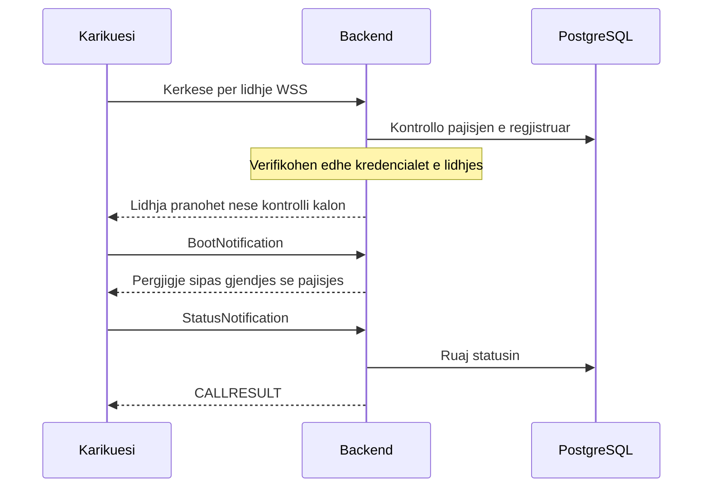

Ky eshte nje diagram i thjeshtuar. Vetem ekzistenca e ID-se ne databaze nuk mjafton per te besuar pajisjen; nevojitet edhe autentikimi i lidhjes.

### Fillimi i karikimit

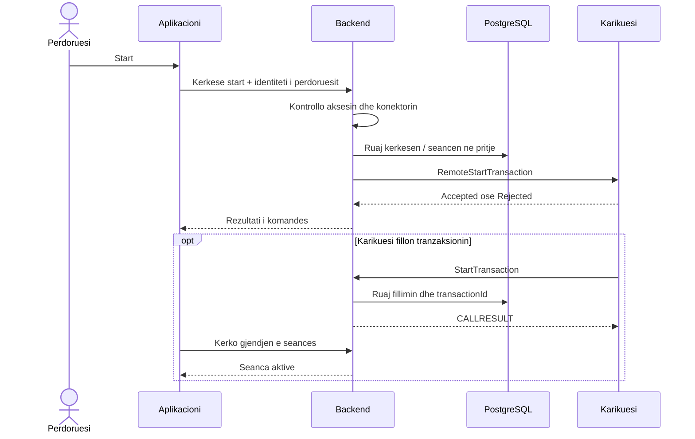

Diagrami perdor komandat OCPP 1.6-J. Sipas konfigurimit, karikuesi mund te dergoje edhe Authorize. Backend-i duhet te kontrolloje identifikuesin e karikimit perpara pranimit.

### Matjet dhe shfaqja ne aplikacion

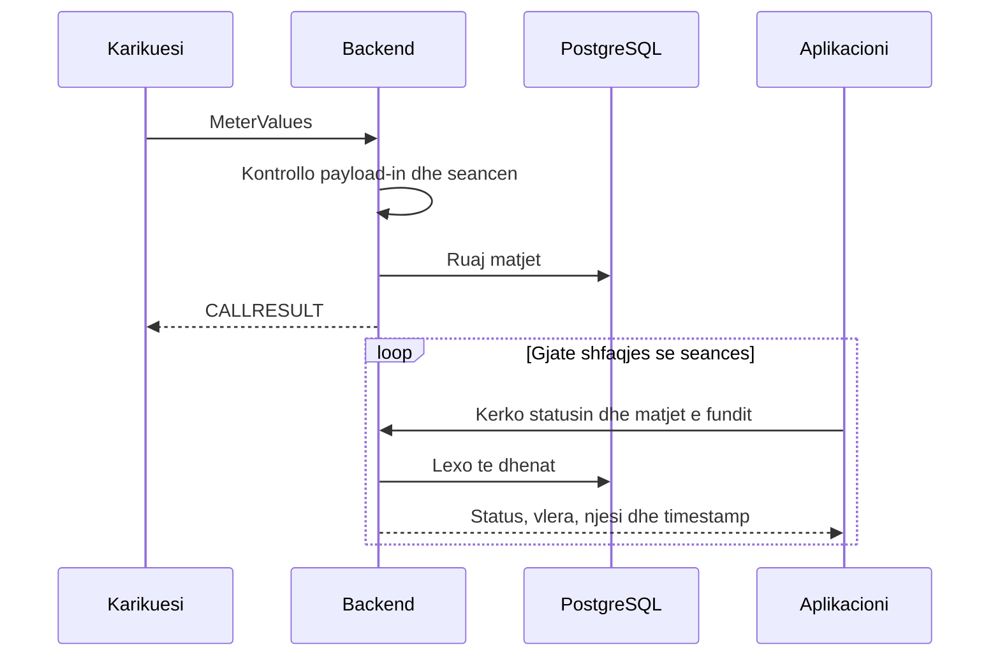

Koha kur UI-ja ben polling dhe koha kur karikuesi dergon matje nuk jane te njejta. Aplikacioni mund te marre te njejten matje ne disa kerkesa radhazi. Per kete arsye timestamp-i duhet te jete pjese e pergjigjes.

### Ndalimi i karikimit

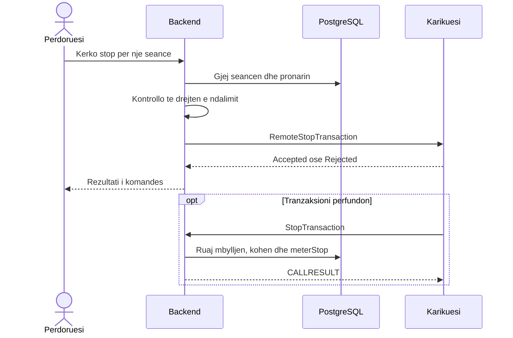

Seanca duhet te shenohet e perfunduar nga informacioni i karikuesit, jo vetem nga shtypja e butonit Stop. Ajo mund te perfundoje edhe nga nje veprim lokal, pa nje kerkese nga aplikacioni.

## Backend / OCPP 

### Si do te organizohej komunikimi

Controller-i do te marre kerkesen e perdoruesit dhe do te therrase service-in e seancave. Ky service do te beje kontrollet dhe do t'i kerkoje shtreses OCPP dergimin e komandes. Kur vjen nje mesazh nga karikuesi, shtresa OCPP do ta kaloje informacionin te service-i perkates.

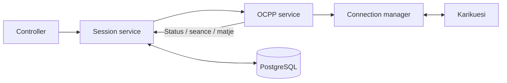

Kjo ndarje do te me ndihmonte te ndryshoja logjiken e seancave pa ndryshuar cdo here kodin e WebSocket-it. Fillimisht do te mbaja vetem versionin OCPP te nevojshem per pajisjet e zgjedhura.

### Identifikuesit dhe gjendja

| Identifikuesi | Per cfare perdoret |
| --- | --- |
| User ID | Kush po kerkon karikimin |
| Charger ID dhe connector ID | Ku do te kryhet karikimi |
| Session ID | Seanca qe sheh aplikacioni |
| OCPP transactionId | Tranzaksioni qe njeh karikuesi |
| messageId | Perputh nje CALL me pergjigjen e tij |

Gjithashtu do te ndaja gjendjen e lidhjes nga gjendja e konektorit dhe e seances. Nje karikues mund te humbase internetin, por makina te vazhdoje te karikohet. Nuk do ta shenoja automatikisht seancen te perfunduar vetem sepse socket-i u mbyll. Ne momentin e rilidhjes mund te konfirmohen gjendjen e seances.

### Rastet qe kerkojne me shume kujdes

Nese perdoruesi shtyp Start dy here, qellimisht ose jo, backend-i duhet te kontrolloje nese ka tashme nje kerkese ose seance aktive. Vetem çaktivizimi i butonit ne frontend nuk mjafton. Nese dy kerkesa vijne pothuajse ne te njejten kohe, nje kontroll i thjeshte ne kod mund te mos jete i mjaftueshem.

Nese komanda nuk merr pergjigje, do t'i tregoja perdoruesit qe rezultati nuk u konfirmua. Nuk do te beja automatikisht retry te start-it, sepse pajisja mund ta kete marre komanden e pare. Ne raste se duhet kryer nje perseritje e request-it, ateher do te prezantoja nje *Idempotency-Key* ne API, i gjeneruar nga frontend-i. Nese backend-i merr nje request me te njejtin celes, ateher nuk dergon nje komande te dyte, por kthen rezultatin e komandes se meparshme. Ne kete menyre bejme diferencen midis request-eve te reja dhe ato te perseritura.

## Dezanj i Databazes

### Modeli fillestar i te dhenave

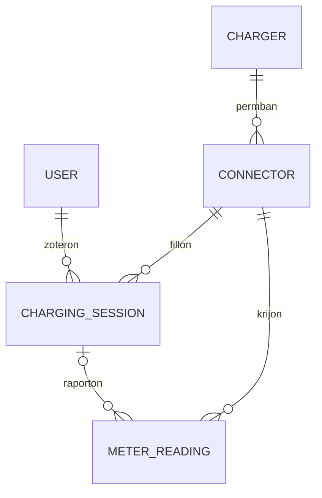

| Tabela | Fushat kryesore qe do te ruaja |
| --- | --- |
| Users | ID dhe te dhenat e nevojshme te llogarise |
| Chargers | ID, emri/vendndodhja dhe koha e fundit e komunikimit |
| Connectors | ID brenda karikuesit, chargerId dhe statusi |
| ChargingSessions | ID, userId, konektori, transactionId, statusi, fillimi, fundi, meterStart dhe meterStop |
| MeterReadings | Konektori, seanca nese njihet, timestamp-i, vlera |

Nje seance e perfunduar nuk duhet te fshihet; ajo duhet te ruhet qe perdoruesi te shohe historine. Lidhja me perdoruesin duhet te jete ne databaze, ne menyre qe autorizimi i stop-it te mos varet nga informacioni qe dergon klienti.

### Probleme te mundshme me ruajtjen

Nje seance perfshin disa ndryshime: krijimin e rekordit, lidhjen me konektorin dhe perditesimin e statusit. Keto duhet te mbeten te perputhshme. Do te perdorja transaksione database aty ku disa shkrime duhet te perfundojne se bashku, por nuk do te mbaja nje transaksion hapur gjate gjithe pritjes se pergjigjes nga karikuesi.

Mbetet nje rast i veshtire: backend-i mund ta ruaje kerkesen dhe te ndalet para dergimit, ose ta dergoje komanden dhe te ndalet para ruajtjes se rezultatit. Ruajtja ne database vetem nuk e zgjidh kete. Duhet percaktuar si zbulohen dhe kontrollohen kerkesat qe kane mbetur te paperfunduara.

Per matjet do te ruaja kohen e raportuar nga pajisja dhe kohen kur backend-i i mori. Kjo ndihmon kur matjet vijne me vonese. Nje lexim i vjeter mund te kete vlere per historine, por nuk duhet te zevendesoje matjen me te re ne UI.


## Scalability & Reliability

### Cfare ndodh kur rritet perdorimi?

Nje backend i vetem eshte me i thjeshte per t'u ndertuar dhe kuptuar, por ka kufij. Me shume karikues do te kete me shume lidhje WebSocket dhe mesazhe. Me shume perdorues do te kete me shume kerkesa HTTP. Databaza duhet te perballoje te dyja: ruajtjen e matjeve dhe leximet per aplikacionin.

Pershembull, 1,000 perdorues qe bejne polling cdo 2 sekonda krijojne rreth 500 kerkesa ne sekonde. Nese cdo kerkese kthen te gjithe karikuesit, ngarkesa rritet me tej.

Fillimisht do te kufizoja leximet te karikuesi ose seanca me interes dhe do te testoja sjelljen me disa kliente. Do te matja kohen e pergjigjes, perdorimin e memories dhe gabimet. Nuk mund te percaktoj nje kapacitet te sakte pa keto prova.

### Pse shtimi i nje backend-i tjeter nuk mjafton?

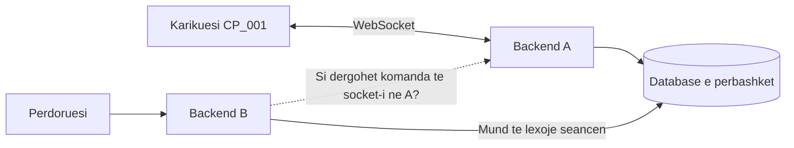

Nese pajisja eshte lidhur te A, backend-i B nuk e ka socket-in e saj. Nje database e perbashket ndihmon me te dhenat, por nuk e transferon lidhjen WebSocket. Sistemi duhet te dije cili backend e mban pajisjen dhe si t'ia kaloje atij komanden.
Nje qajse do te ishte hash-routing, ku si hash perdoret *chargePointId*. Kjo do te garantonte qe cdo request per nje karikues te vecante godet te njejten instance serveri. 
Probleme qe mund te hasi nje qasje e till: 
- Request-e qe perfshijne te gjithe karikuesat, si *GET .../ocpp/chargers*, nderkohe qe karikues te ndryshem kane krijuar lidhje WebSocket me instanca te ndryshme. Ne kete raste hash-routing nuk ndihmon. 
- Raste rilidhje te karikuesit me instancen e serverit. Nje perdorues mund te jete hashed me CP_001, dhe karikuesi eshte tashme i lidhur me nje instance serveri A. Por per arsye te ndryshme karikuesi shkeputet, dhe vendos te lidhet me instancen B. Tashme hash-routing nuk mund ta coj requestin ne instancen e duhur.
- Implementimi i nje algoritmi te pamenduar per hashing mund te shkaktoj konflikte ne rastin e shtimit te instancave.

Nje qasje me moderne do te ishte perdorimi i message-brokers, si Redis, e cila do te lejonte komunikimin midis instancave. Pra ne rast se requesti godet nje instance e cila nuk eshte e lidhur me ate karikues specifik, kjo kerkese mund te hyj ne msssage-broker dhe te merret nga instanca e sakte.

## Security

### Identiteti dhe te drejtat e perdoruesit

Perdoruesi duhet te beje login perpara se te kerkoje karikimin. Backend-i duhet te verifikoje identitetin ne cdo kerkese te mbrojtur. Por login nuk mjafton: duhet te kontrollohet edhe nese ai perdorues ka te drejte te veproje mbi seancen e kerkuar.

Shembulli me i rendesishem eshte stop. Nese perdoruesi A ndryshon ID-ne ne URL, ai nuk duhet te mund te ndaloje seancen e perdoruesit B. Backend-i duhet te lexoje pronarin e seances nga databaza dhe ta krahasoje me perdoruesin e autentikuar.

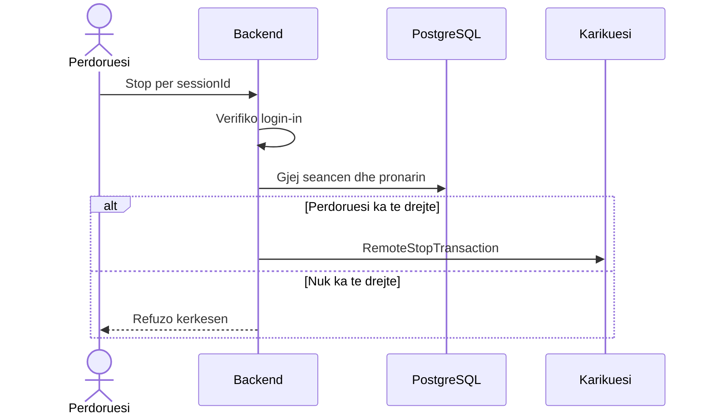

Nje operator mund te kete te drejta shtese, por duhet percaktuar qarte se cilat jane ato. Te njejtat kontrolle vlejne edhe per leximin e historise.

### Identiteti i karikuesit

ID-ja ne URL e identifikon karikuesin qe klienti pretendon se eshte; nuk provon identitetin e tij. Per perdorim real duhet nje menyre autentikimi e suportuar nga pajisja, pershembull kredenciale individuale ose certifikate, dhe komunikim i enkriptuar me WSS/TLS.

Do ta zgjidhja menyren konkrete pasi te kontrolloja cfare suportojne karikuesit. OCPP 1.6 ka udhezime sigurie nga OCA qe duhen studiuar per kete pjese. [OCPP 1.6 Security Whitepaper](https://openchargealliance.org/ocpp-info-whitepapers/ocpp-1-6-security-whitepaper-4th-edition/).

`Authorize` dhe `idTag` ne OCPP jane pjese e autorizimit te karikimit. Nuk zevendesojne login-in e aplikacionit. Backend-i duhet te kontrolloje lidhjen midis perdoruesit, identifikuesit te karikimit dhe seances. Nuk duhet te pranoje automatikisht cdo idTag qe shkruan klienti.

### Kontrollet baze dhe pyetjet qe mbeten

| Kontrolli | Pse nevojitet |
| --- | --- |
| HTTPS dhe WSS | Per te mbrojtur komunikimin ne rrjet |
| Validimi i input-eve | Per te mos perpunuar payload-e te gabuara si te vlefshme |
| Kontrolli i pronarit te seances | Per te penguar veprimet mbi karikimin e dikujt tjeter |
| Kufizimi i kerkesave | Per te shmangur dergimin e pakufizuar te komandave |
| Log-e pa password ose token | Per te hetuar problemet pa ekspozuar kredencialet |

## 10. Proof of Concept dhe Evidenca

### 10.1 Cfare demonstron projekti

Proof of concept lidh simulatorin me backend-in dhe lejon aplikacionin te dergoje komanda. Funksionalitetet jane te pranishme ne kod, por mbulimi i rasteve negative eshte ende i kufizuar.

| Kerkesa | Gjendja ne implementim | Prova / kufizimi |
| --- | --- | --- |
| KF-01: Pranim lidhjesh | Implementuar | Figura 1; pa autentikim pajisjeje |
| KF-02: Status konektori | Implementuar ne memorie | StatusNotification → ChargeStateService |
| KF-03: Remote start | Implementuar | Controller → sendCall; mungon autorizimi real |
| KF-04: Remote stop | Implementuar me bug-e te hapura | Route stop ekziston; nevojitet prova e plote start-stop-start |
| KF-05: Informacion seance | Pjeserisht | Seance aktive ne Map; pa histori te qendrueshme |
| KF-06: Lexime metri | Implementuar per grupin me te fundit | Figura 4 dhe updateMeterValues; pa historik |
| KF-07: Shfaqje ne UI | Implementuar | Polling cdo 2 sekonda; screenshot-i i frontend-it duhet shtuar |

Per kerkesat jo-funksionale: lidhjet dhe logimi bazik ekzistojne, por persistence, kontrolli i aksesit, shkallezimi ne disa instanca dhe matjet e performances nuk jane realizuar.

### 10.2 Arkitektura dhe kontrata e implementimit prove

Pjesa e mesiperme pershkruan arkitekturen fillestare te propozuar dhe pyetjet e saj te hapura. Ne proof of concept eshte realizuar nje pjese me e vogel e kesaj arkitekture, me nje proces dhe gjendje ne memorie.

Backend-i ka dy pika hyrjeje: HTTP per aplikacionin dhe WebSocket per karikuesit. Te dyja ekzekutohen ne te njejtin proces NestJS dhe ndajne te njejtat service dhe Map-e ne memorie.

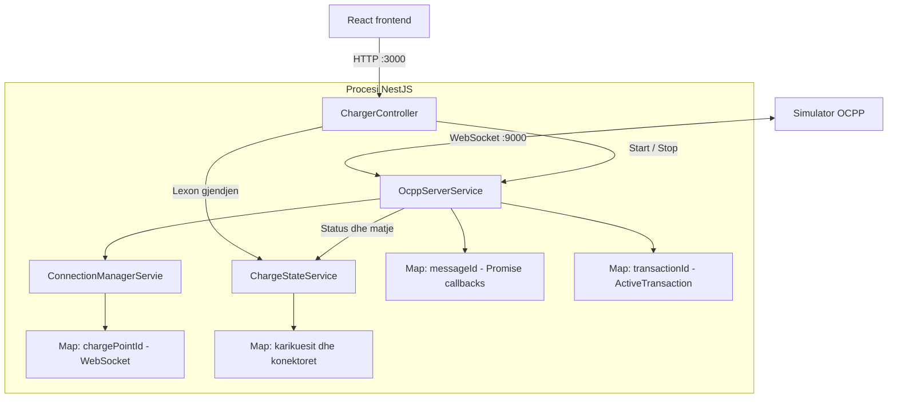

Emri `ConnectionManagerService` ne diagram eshte ai qe gjendet aktualisht ne kod. Ky service ruan referencat e socket-eve; `ChargeStateService` ruan gjendjen qe do te ekspozohet ne API. Nje WebSocket nuk serializohet per frontend-in.

| Komponenti | Pergjegjesia aktuale | Kufizimi |
| --- | --- | --- |
| `ChargerController` | Listim, detaje, start dhe stop | Nuk kontrollon identitetin ose te drejtat e perdoruesit |
| `OcppServerService` | Pranon lidhje, dergon/perpunon frames, mban tranzaksionet | Transporti dhe logjika e seancave jane ne nje service |
| `ConnectionManagerServie` | Gjen socket-in nga ID-ja e karikuesit | Map lokal per nje proces |
| `ChargeStateService` | Gjendja e konektoreve dhe matja me e fundit | Pa histori ose database |
| `OcppActionMap` | Lidh action me tipin request/response | TypeScript nuk validon JSON ne runtime |

Referencat ne projekt: [serveri OCPP](backend/src/ocpp/ocpp-server.service.ts), [connection manager](backend/src/ocpp/connection-manager.service.ts), [gjendja](backend/src/ocpp/charger-state.service.ts), [controller-i](backend/src/charger/charger.controller.ts), [tipet](backend/src/ocpp/ocpp.types.ts).

Frontend-i i proves lexon `GET /chargers` cdo 2 sekonda, pa nisur nje kerkese tjeter nese e meparshmja eshte ende pending. Ky polling nuk ndryshon frekuencen e MeterValues qe dergon pajisja. Komandat start/stop presin pergjigjen OCPP brenda kerkeses HTTP; kerkesat ne pritje ruhen vetem ne memorie.

| Endpoint aktual | Input | Rezultati |
| --- | --- | --- |
| `GET /chargers` | Pa body | Karikuesit e njohur nga procesi, perfshire te shkeputurit |
| `GET /chargers/:id` | ID ne URL | Gjendja e nje karikuesi dhe konektoret |
| `POST /chargers/:id/start` | `idTag`, opsionalisht `connectorId` | Pergjigjja e RemoteStartTransaction |
| `POST /chargers/:id/connector/:connector/stop` | ID dhe konektori ne URL | Kerkohet tranzaksioni aktiv dhe dergohet RemoteStopTransaction |

Route-i stop perdor konektorin, jo nje `transactionId` te derguar nga UI-ja. Kjo ul informacionin qe duhet te menaxhoje klienti, por backend-i duhet te siguroje qe seanca e gjetur i perket perdoruesit qe po ben kerkesen.

`OcppModule` eksporton service-t per `ChargerModule`. Serveri perdor direkt `WebSocketServer` nga `ws`. Pending requests kane Promise callbacks dhe kontroll te socket-it; timeout-i lokal eshte 10 sekonda. Te dhenat e karikuesve, tranzaksioneve dhe matjeve humbasin ne restart.

MeterValues ruan vetem grupin me timestamp me te ri per konektor. Nuk ruhet ende historia ose snapshot i pavarur per secilin measurand. Nese matjet vijne para StatusNotification, konektori krijohet me gjendje `Unknown`; statusi pasues bashkohet me te dhenat ekzistuese. UI-ja shfaq timestamp-in e matjes vecmas kohes se statusit.

### 10.3 Screenshot-et e implementimit prove

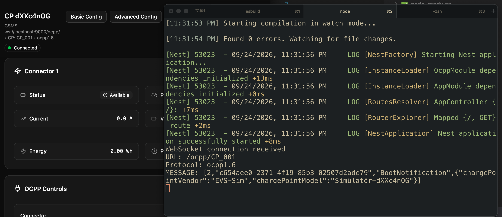

Figura 1: evidenca ekzistuese tregon URL-ne `/ocpp/CP_001`, protokollin dhe frame-in hyres.

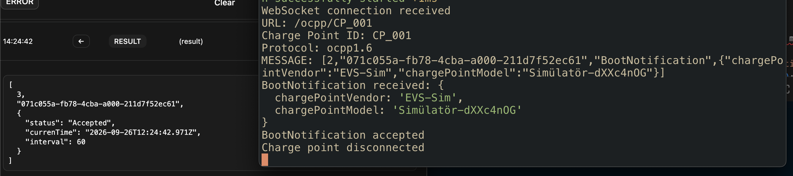

Figura 2: ne screenshot shihet `Accepted`, `currentTime` dhe `interval: 60`. Kodi aktual kthen `interval: 10`; figura dokumenton nje version te meparshem.

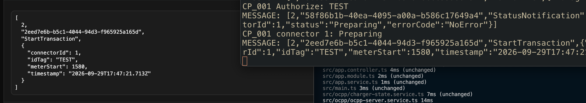

Figura 3: shihen `idTag: TEST`, `connectorId: 1`, `meterStart` dhe timestamp-i i StartTransaction. P

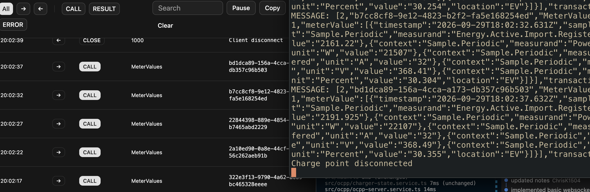

Figura 4: shihen mesazhe periodike MeterValues dhe fusha si energjia, fuqia dhe SoC. Kjo figure provon marrjen/logimin ne ate faze;

## 11. Testimi dhe Problemet e Hasura

### 11.1 Probleme te dokumentuara gjate zhvillimit

Keto vijne nga shenimet e meparshme te projektit dhe nga ndryshimet e bera gjate zhvillimit. Nuk jane te gjitha bug-e qe vazhdojne te jene aktive.

| Problemi | Shkaku / mesimi | Gjendja |
| --- | --- | --- |
| Serveri WebSocket inicializohej dy here dhe zinte te njejtin port | Service-i duhet te kete nje instance te perbashket ne modul | I dokumentuar ne backend/NOTES.md; wiring aktual eksporton service-t nga OcppModule |
| Dergimi i komandes trajtohej sikur ishte edhe rezultati | WebSocket send nuk eshte pergjigje OCPP | Tani ka Promise dhe pendingRequests me messageId |
| CALL-e pa pergjigje bllokonin rrjedhen e pritur | Klienti pret CALLRESULT ose CALLERROR | Veprimet e implementuara pergjigjen; action-et e panjohura mbeten problem |
| Connector Map nuk eshte JSON array | Strukturat e memories ndryshojne nga DTO-t e API-se | Controller-i perdor Array.from per konektoret |
| StatusNotification mund te zevendesonte te gjithe objektin e konektorit | Do te humbnin matjet e ruajtura | updateConnector bashkon gjendjen e vjeter me statusin e ri |

Zgjedhja e transportit ishte gjithashtu e rendesishme: OCPP 1.6-J ne kete projekt perdor WebSocket standard. Socket.IO shton nje protokoll te vetin dhe nuk eshte zevendesim transparent per kete lidhje.


### 11.2 Cfare duhet testuar

| Prova | Rezultati qe duhet kontrolluar |
| --- | --- |
| BootNotification | ID e njejte ne pergjigje; currentTime, interval dhe status ne formen e duhur |
| Remote start me Accepted dhe Rejected | Rezultati i sakte per klientin; pa shpallur seancen aktive vetem nga Accepted |
| Dy komanda me pergjigje ne rend te kundert | Secila Promise merr pergjigjen e vet |
| CALLRESULT nga socket tjeter | Nuk zgjidh kerkesen e lidhjes origjinale |
| Start → Stop → Start | Seanca e pare mbyllet sakte dhe e dyta ka ID te re |
| MeterValues para StatusNotification | Nuk humbet matja dhe konektori krijohet ne menyre te kontrolluar |
| Matje te vjetra / te njejta / kohe e pavlefshme | Nuk korruptojne snapshot-in |
| Disconnect dhe reconnect me te njejtin ID | Close nga socket-i i vjeter nuk heq lidhjen e re |
| Timeout dhe pergjigje e vonuar | Pa pending entries te mbetura dhe pa retry te verber |
| Dy perdorues dhe nje seance | Vetem pronari/operatori i autorizuar mund ta ndaloje |
| Dy karikues me te njejtin transactionId te pretenduar | Njeri nuk ndryshon seancen e tjetrit |
| Restart gjate karikimit | Pas persistence/reconciliation, seanca rikuperohet |
| Ngarkese me shume karikues | Matje e latences, memories, event loop lag dhe humbjes se mesazheve |

Provat me simulator duhen ndjekur nga prova me pajisje reale dhe kontroll ndaj skemave OCPP. Simulatori aktual ka nje fallback qe gjeneron nje transactionId kur mungon ne pergjigje; kjo mund te fshehe nje pergjigje te gabuar te backend-it. Prandaj funksionimi i simulatorit nuk eshte prove e perputhshmerise se plote me protokollin.

## 12. Cfare Mungon per Production

Perpara perdorimit real do te perqendrohesha te keto hapa:

1. Te funksionoje sakte cikli start-stop-start dhe te rregullohen bug-et e ndryshme.
2. Te kete login dhe kontroll qe perdoruesi mund te veproje vetem mbi seancen e tij.
3. Te ruhen seancat ne PostgreSQL dhe te provohet cfare ndodh pas restart-it.
4. Te kontrollohen payload-et dhe identiteti i karikuesit, me komunikim te enkriptuar.
5. Te provohen shkeputjet, timeout-et dhe disa perdorues/karikues njekohesisht.

Me pas do te diskutoja me ekipin ngarkesen e pritshme, ruajtjen e historise dhe nevojen per disa instanca. Nuk e konsideroj ende te zgjidhur menyren si do te rikuperohen te gjitha seancat pas nje deshtimi ose si do te drejtohen komandat midis serverave.

